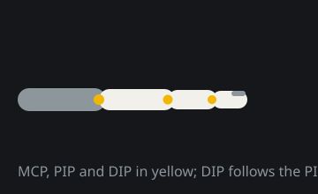
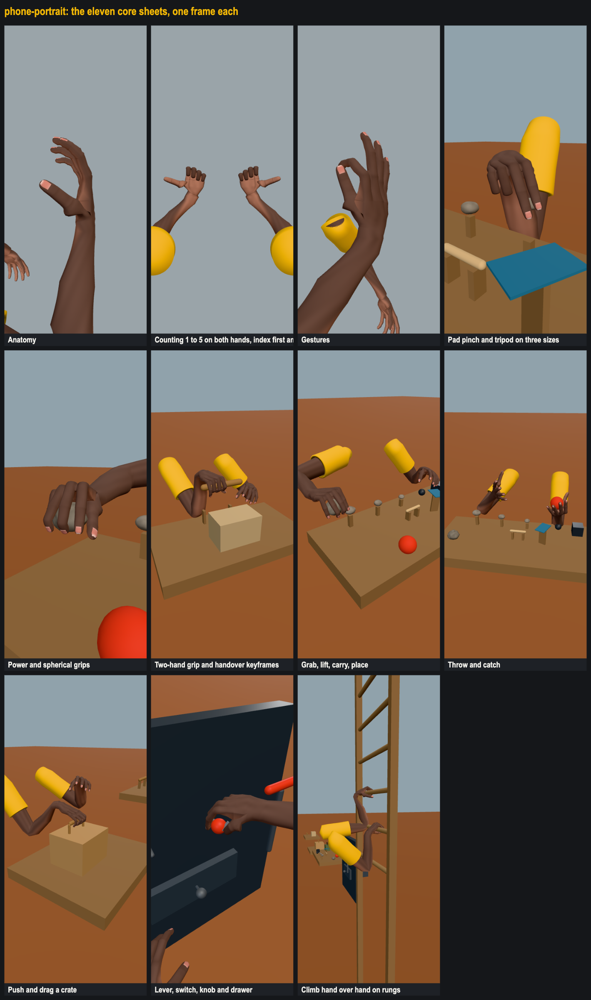
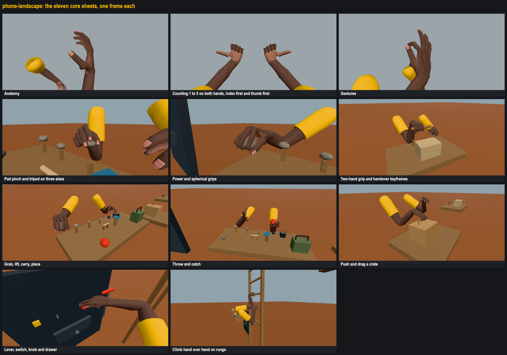
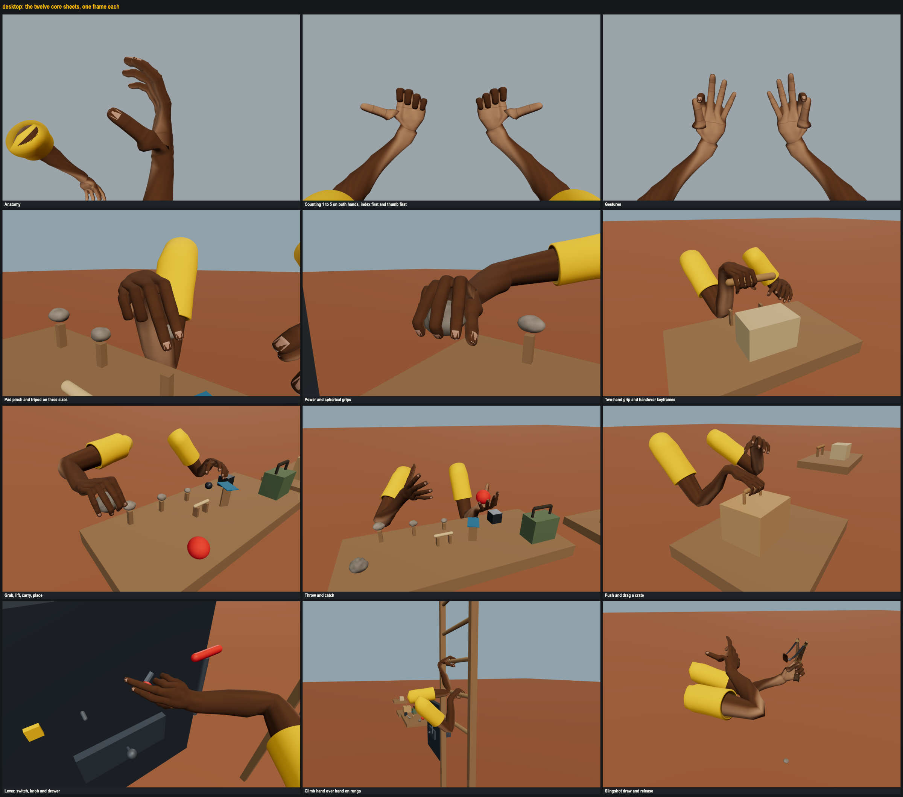
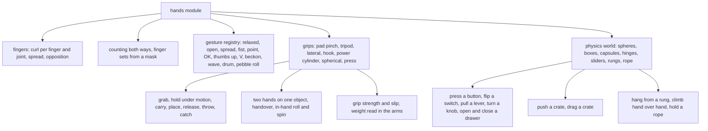
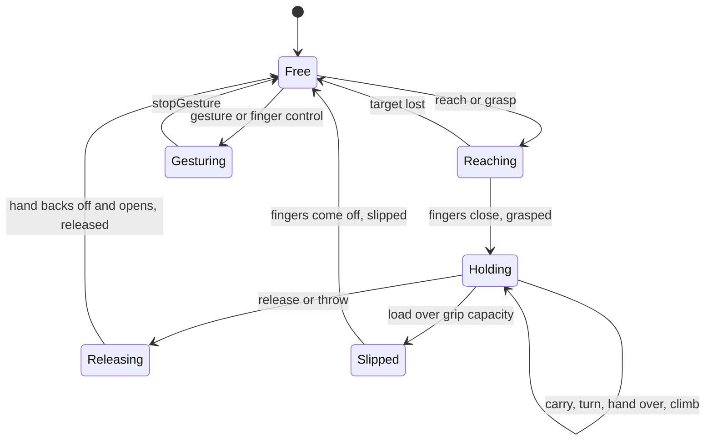
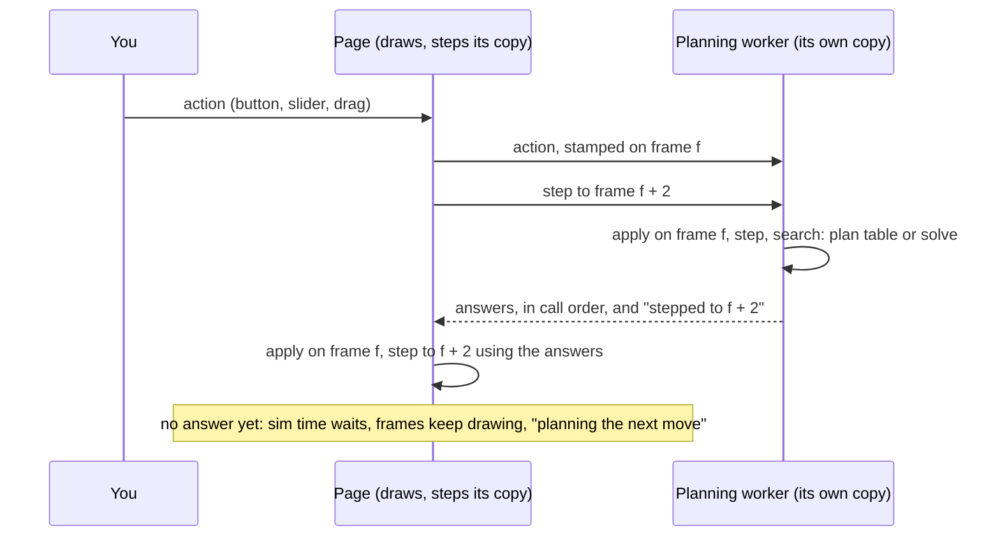

# 25th procedural hands

Procedural human hands and arms for the browser, with no animation files: every pose, grip and gesture is solved at run time from anatomy (bone lengths, joint limits, finger coupling) and from the shape and size of what the hand is holding. The library lives in [`hands/src`](hands/src) and imports nothing but [three.js](https://threejs.org). Around it, this repository holds an interaction sandbox that exercises every capability: grips on objects of many sizes, carrying, throwing and catching, buttons, switches, a lever, a knob, a drawer, a crate to push and drag, a rope and a ladder to climb.

<p align="center"></p>

<!-- VIDEO: 25TH drops a directly uploaded video here (drag the .mp4 into this spot in the GitHub editor). -->
> **Video goes here.** A short capture of the sandbox on a phone, uploaded directly to this README.

| Phone portrait | Phone landscape | Desktop |
| --- | --- | --- |
|  |  |  |

## Install and run

Node 20 or newer. Dependencies are pinned exactly and installed without running package scripts:

```sh
npm ci --ignore-scripts
PORT=3100 npm start
```

The server prints the sandbox URL on this machine and on the local network (open the LAN one on a phone). Port 3100 is the default; a taken port exits with a clear message.

| Command | What it does |
| --- | --- |
| `npm start` | The static dev server: whitelisted files only, strict CSP (no inline scripts, no eval, workers only from the same origin), `nosniff`, `frame-ancestors 'none'` |
| `npm run check` | `node --check` over every source folder, and a scan for characters the house style bans |
| `npm test` | `node --test`: module, physics, server and isolation tests |
| `npm run hands:check` | The acceptance suite: every check with its worst measured value against its limit |
| `npm run hands:matrix` | The capability matrix: one row per capability, the checks and sheet that prove it, PASS or FAIL |
| `npm run hands:plans` | Rebuilds the recorded plan table the sandbox replays scripted actions from (needed after any change to `hands/src` or `app/scenes`; `hands:check` fails while it is stale) |
| `npm run hands:gallery` | Renders the sheets in a real browser at 390x844, 844x390 and 1440x900 into `artifacts/gallery/` |
| `npm run gate` | check, test, hands:check, hands:matrix and `npm audit --audit-level=high`: every commit passes it |

## Use the module

```js
import { create } from './hands/src/index.js';
import { createThreeView } from './hands/src/three-view.js';

const hands = create({ seed: 7, world: true });   // world: true gives the hands a physics world to act on
scene.add(createThreeView(hands).group);           // one skinned mesh per arm

hands.gesture('thumbsUp', { hand: 'right' });
hands.setFinger('left', 'index', 0.8, 0.2);         // curl 0 to 1, spread -1 to 1
hands.count('both', 3, 'thumb');                    // counting, thumb first
hands.on('grasped', (e) => console.log(e.hand, e.grip));

const ball = hands.world.add({ shape: 'sphere', r: 0.035, mass: 0.06, pos: [0.15, -0.46, -0.4] });
hands.reach('right', ball, 'spherical', { approach: 0.06 });
// ...once hands.arrived('right'):
hands.grasp('right', ball, 'spherical');

function frame(dt) { hands.update(dt); view.update(); }  // fixed 60 Hz steps inside
```

<details>
<summary>API</summary>

| Call | What it does |
| --- | --- |
| `create(options)` | A `Hands` instance. Options: `seed`, `reducedMotion`, `targets`, `world` (`true` or a `World`), `strength`, `skinTone` (a Monk Skin Tone Scale tone, default `monk-8`), sleeve colour, object presets |
| `update(dt)` / `step()` | Advance by wall seconds in fixed 60 Hz steps / one step |
| `setPose(hand, pose)` | A named pose from `POSES` (hand is `'left'`, `'right'` or `'both'`) |
| `blendPose(hand, pose, weight, { mask })` | Blend a pose over the active one, per digit mask |
| `setFinger(hand, finger, curl, spread)` | Per finger curl 0 to 1 and spread -1 to 1, anatomically clamped, over whatever pose is active |
| `setFingerJoint(hand, finger, joint, curl)` | One joint: `mcp`, `pip`, `dip` (thumb: `cmc`, `mcp`, `ip`) |
| `setThumbOpposition(hand, amount)`, `releaseFingers(hand, finger)` | Thumb opposition; hand a digit back to the pose |
| `count(hand, n, style)`, `showFingers(hand, set)` | Counting 1 to 5 index first or thumb first; any combination of extended digits |
| `gesture(name, { hand })`, `stopGesture(hand)` | Any gesture in the registry (data: `GESTURES`, `registerGesture`) |
| `setTarget(hand, { pos, rot, pole })`, `moveTo(hand, target)` | IK target for the wrist; `moveTo` routes round anything in the way |
| `grasp(hand, object, gripType)` | Close a grip on an object (a shape, a world body, a body part, a prop part, a rung or the rope) |
| `release(hand, { velocity })` | Let go (a velocity throws) |
| `attach(hand, object)`, `detach(hand)` | Fix an object to the wrist without solving a closure |
| `reach(hand, target, grip, opts)`, `arrived(hand)` | Plan and move to a grip pose, approach clear of obstacles |
| `carry(body, target)`, `intent(hand, target)`, `setDown(hand)` | Carry with one or two hands; drive a held prop; lower until it rests |
| `readyCatch`, `planCatch(hand, body, grip)` | Meet a flying body at the point it will pass |
| `spin(hand, axis, rate)` | Turn a held object in the fingers |
| `setBody(pos)`, `moveBody(pos, seconds)` | Move the body anchor (hang and climb) |
| `on(event, fn)` | Events: `contact`, `grasped`, `released`, `slipped` |
| `holding(hand)`, `held(hand)`, `contacts(hand)`, `joint(hand, name)`, `hash()` | State; `hash()` covers joints and the whole world, for replays |
| `dispose()` | Tear down |

</details>

## Capabilities



Each hand moves through the same states whatever it works on. `contact`, `grasped`, `released` and `slipped` are the events it emits on the way.



Every one of them has a row in `npm run hands:matrix` naming the check that proves it and the gallery sheet that shows it. Each manipulation is a scripted scenario in [`app/scenes/capabilities.js`](app/scenes/capabilities.js) with a statement of what it must achieve in [`app/scenes/expectations.js`](app/scenes/expectations.js); the checks play it frame by frame and fail it if it penetrates, drops what it holds, pops, or does not do what it is for.

A grasp contact is a phalanx capsule (segment $a\,b$, radius $r$) resting on the object's surface inside the pad squish band:

$$ -\delta_{\text{squish}} \le \min_{\mathbf p \in [a,b]} \operatorname{sdf}(\mathbf p) - r \le 0.3\ \text{mm}, \qquad \delta_{\text{squish}} = 0.45\ \text{mm} $$

A held object slips when the force needed to hold it through the hand's own motion is more than the grips on it can give, for two frames running:

$$ m\,\lVert \mathbf a + \mathbf g \rVert > \sum_{\text{hands on it}} C_{\text{grip}} $$

with the capacities $C$ per grip in `GRIPS` (a pad pinch 16 N, a power grip 160 N). Weight reads in the arms: the wrist drops by $2.2\ \text{mm}$ per newton carried, capped at 7 cm, and settles with the load.

<details>
<summary>Limits the checks hold every scenario to</summary>

| Measure | Limit |
| --- | --- |
| Hand into any object, static, prop or rope | 1 mm |
| Finger into finger or palm | 1 mm |
| A gripping digit off what it holds, once the grip has formed | 2 mm |
| A hand off what it follows (position plus the turn as its arc 8 cm out) | 5 mm |
| Joint angular speed | under 20 rad/s |
| Wrist travel per frame | under 4 cm |
| Joint limits | never passed |
| Bodies moving without contact, bodies at rest in the air | none |
| Hands attached while climbing | at least one |
| Replay of a 30 s scripted run | identical hashes |

</details>

## Budgets

Two sets, each on its own subject, as set in [the spec's BUDGETS section](docs/HANDS_SANDBOX_SPEC.md). Measured by `npm run hands:check`; the values below are from the run on 2026-09-23.

Hands module alone, no sandbox props:

| Budget | Measured | Limit |
| --- | --- | --- |
| Triangles, both arms, high LOD | 14 504 | 20 000 |
| Triangles, both arms, low LOD | 5 960 | 8 000 |
| Draw calls, both arms | 2 | 6 |
| Bones | 60 | 80 |
| Rig step ms (one fixed step of the module alone), median in Node | 0.047 ms | 0.5 ms |

Sandbox scene loaded:

| Budget | Measured | Limit |
| --- | --- | --- |
| Triangles, worst of six stations | 23 786 | 30 000 |
| Draw calls, worst of six stations | 37 | 45 |
| Bones | 60 | 80 |
| Sim step ms (one fixed step: script keys, rig, interaction, physics), median in Node | 0.891 ms | 1.2 ms |
| Sim step ms, median, live in headless Chromium (the perf overlay's figure) | 1.4 to 2.4 ms (bimodal run to run) | 3.0 ms |
| Sim step ms, 95th percentile, live | 2.6 to 3.3 ms | 4.5 ms |
| Sim step ms, worst step, live (the page's per-frame sim budget) | 3.3 to 6.8 ms | 8.0 ms |

The perf overlay and the checks use the same names for the same things: **sim step ms** is one fixed 1/60 s step of the scene, **frame ms** is the main thread's JavaScript for one animation frame (not GPU time), each shown as the median of the last 120. Beside them the overlay shows **sim step p95 ms** (the 95th percentile of the last 120 steps) and **sim step worst ms** (the worst of the last 600, 10 s), the figures the tail budgets hold. The worst step may not pass 8 ms, the page's simulation budget for one frame; the reasons for each limit are in [the spec](docs/HANDS_SANDBOX_SPEC.md#budgets). The sandbox triangle and draw-call counts come from three's `renderer.info` after rendering in headless Chromium on the machine running the check, not from a phone. The on-device figures come from the sandbox's perf overlay.

## Skin tones

The hands come in the ten tones of the **Monk Skin Tone Scale**, from `monk-1` (lightest) to `monk-10` (deepest). The source is Monk, E. (2023), *The Monk Skin Tone Scale*, SocArXiv, [doi:10.31235/osf.io/pdf4c](https://doi.org/10.31235/osf.io/pdf4c), with the values Google publishes at [skintone.google](https://skintone.google). Monk rather than Fitzpatrick because it is a colour scale built to represent the whole human range evenly and publishes its colours; Fitzpatrick sorts skin by how it burns and tans, has no official colours and is weighted toward lighter skin.

Every tone has its own undertone, a palm lighter than the back (slightly on the lightest tones, far lighter on the deepest), and a nail bed that stands out against it. Each is checked as rendered, not only in the palette: `npm run hands:check` draws every tone and keeps the back of the hand within 2.5 dE of the published swatch and the palm lighter than the back. The sandbox's picker sits beside the hand picker in the control centre, and the gallery has a sheet of every tone at the anatomy framing. See [hands/README.md](hands/README.md#skin-tones) for the model and the calibration.

<details>
<summary>The ten tones</summary>

| Tone | Published | Undertone |
| --- | --- | --- |
| Monk 1 | `#f6ede4` | neutral |
| Monk 2 | `#f3e7db` | neutral |
| Monk 3 | `#f7ead0` | golden |
| Monk 4 | `#eadaba` | golden |
| Monk 5 | `#d7bd96` | golden |
| Monk 6 | `#a07e56` | neutral |
| Monk 7 | `#825c43` | red |
| Monk 8 | `#604134` | red |
| Monk 9 | `#3a312a` | neutral |
| Monk 10 | `#292420` | neutral |

</details>

## The sandbox

Open the root URL. Two scenes share one injected clock (pause, single step, 0.1x, 0.25x, 1x) and seeded randomness:

- **Hands**: the rig alone on a plain backdrop, for inspection: poses, counting, gestures, grips on objects of any size, per joint sliders for all ten digits.
- **Sandbox**: stations for a ledge of objects, a bench for two hands, a button panel with switch, knob, lever and drawer, a crate, a ladder and a rope. The action palette and the capability matrix play every capability.

The control bar at the bottom holds Controls, Pause, Step and the speed. **Controls** (or the **C** key) opens the control centre with the Actions, Matrix, Joints, Objects, Capture and Settings tabs; **Escape** closes it and **Space** pauses. It starts collapsed and remembers whether you left it open. Open, it docks beside the view instead of over it (a sheet above the bar in portrait, a column at the right in landscape and on desktop), so it never covers the hands, first person included, and opening it changes neither the camera nor the field of view.

**Video.** The Capture tab records the view two ways, both saved to your device (a save dialog where the browser has one, a download otherwise), named for the scene, the action and the time:

- **Record video** (live) records what you see, as you see it, until you press Stop: `canvas.captureStream` into a `MediaRecorder`, in the most efficient codec the browser records (AV1, then VP9, H.264 High, H.264, VP8) at an explicit high bitrate. The Capture tab shows which codec and bitrate it used.
- **Render video** (offline) is the quality path: it plays the action again from its start (or 5, 10 or 20 s of the scene as it is), one fixed 1/60 s step per frame off the injected clock, and encodes every frame with WebCodecs, so the file is 60 fps with nothing dropped whatever the display does. Pick the size, **1920 x 1080** or **2560 x 1440**: the file is exactly that size whatever the size of the view on your screen and whether the control centre is open (the view shows the render letterboxed meanwhile). The containers are written by `app/capture/webm.js` and `app/capture/mp4.js`.

<details>
<summary>Which codec each path uses, and why</summary>

| Path | Tried in order | In Chromium on a Mac | Why that order |
| --- | --- | --- | --- |
| Offline (Render video) | H.264 High in MP4, H.264 Main, VP9 in WebM, VP8 | H.264 High, MP4 | MP4 with H.264 opens in every player, QuickTime included; QuickTime opens no WebM. At 0.2 bits a pixel a frame (capped at 40 Mbit/s) a newer codec buys little. |
| Live (Record video) | AV1, VP9, H.264 High, H.264, VP8 through MediaRecorder | AV1 in WebM | The most efficient codec the browser records live. VLC and browsers play it; QuickTime does not. |

AV1 is not tried offline. The browser's AV1 encoder gives no decoder configuration record (`av1C`), which both WebM and MP4 need for AV1, so the file could not be written to spec. Levels fit the size at 60 fps: H.264 level 5.1 for both sizes, VP9 level 4.1 up to 1080p and 5.0 above.

</details>

The control centre stays closed while a live recording runs (it would resize what is recorded); an offline render leaves it as it is. The bar shows the time or the progress, and pressing it stops or cancels. **Record actions** and **Replay actions**, in the same tab, record the actions you take rather than video, and replay them exactly.

Touch drags the hand's target. In Move camera mode a drag moves the camera the way you drag: right moves it right, up moves it up, and in first person the view turns right and looks up. Settings has Invert X, Invert Y and a sensitivity slider (0.25 to 3); the defaults are the direct mapping, touch and mouse behave the same, and the choice is remembered on the device. Buttons are at least 44 px; portrait and landscape both lay out, clear of notches and home indicators. First person and inspection cameras move only from your input. There is a perf overlay, record and replay, and a reduced motion setting that follows the system's.

**Planning off the main thread.** Where a hand grips, how it opens and which way it comes in are searches that can take a second on a phone. They never run on the page's thread. A planning worker ([`app/plan/`](app/plan)) runs its own copy of the Sandbox simulation two fixed steps ahead of the page, on the same seed and the same actions. It answers each search from the recorded plan table while an action is on its script, and solves it itself once you step off the script (a joint slider, a drag). The page takes the answers in order and never steps past the last one it has. While a plan is still being worked out, the view keeps drawing, sim time waits, and the status line says *planning the next move* with the time so far. Each frame's simulation work has an 8 ms budget, and a scene rebuild is spread over several frames. An action lands at most two steps (33 ms) after you take it, on the same frame in both copies, which is also the frame it is recorded on.



<details>
<summary>What happens on and off the recorded path</summary>

| Situation | Who searches | What the page does |
| --- | --- | --- |
| A scripted action, on its script | The worker answers from the recorded plan table | Steps at once; the worker is never behind |
| Off the script: a slider, a drag, anything not in the script | The worker solves, off the page's thread | Keeps drawing; sim time waits while the worker works, and the status line says so |
| The plan table is stale or missing | The worker solves every search | As above |
| No module workers, or the worker failed | The page, from the plan table where it can | Solves the rest on its own thread (a stall of up to a second or two) |

The two copies are checked to stay identical: in Node, a run answered only from the worker copy's stream ends bit for bit where the worker copy does, including after the run leaves its script, and in the browser `npm run hands:check` moves a slider mid action and fails on any frame held over 50 ms or any search the page had to run itself.

</details>

Shot mode renders any frame exactly from URL parameters, which is what the gallery uses: `/?shot=1&scene=sandbox&cap=throwCatch&t=2.45`.

## Repository

| Path | What is there |
| --- | --- |
| [`hands/`](hands) | The module ([internals and how to extend it](hands/README.md)) and its tests |
| `app/` | The sandbox: scenes, rendering, shot mode, interface |
| `server/` | The static dev server |
| `scripts/` | check, hands:check (`hands-checks/`), hands:matrix, hands:gallery |
| `docs/` | The spec, the list of known minor issues ([HANDS_MINORS.md](docs/HANDS_MINORS.md)), images |

## Credits

Fonts vendored in `app/fonts` under the SIL Open Font License 1.1 (OFL-1.1): **Alfa Slab One** by JM Solé and **Barlow Condensed** by Jeremy Tribby, via Fontsource. The license texts are in `app/fonts/OFL-*.txt`. three.js and anime.js are MIT licensed.
