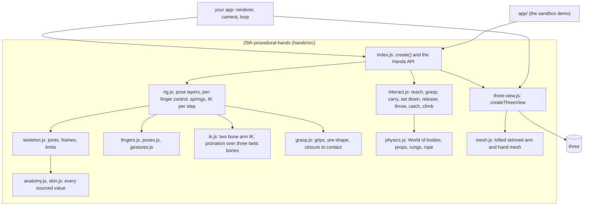
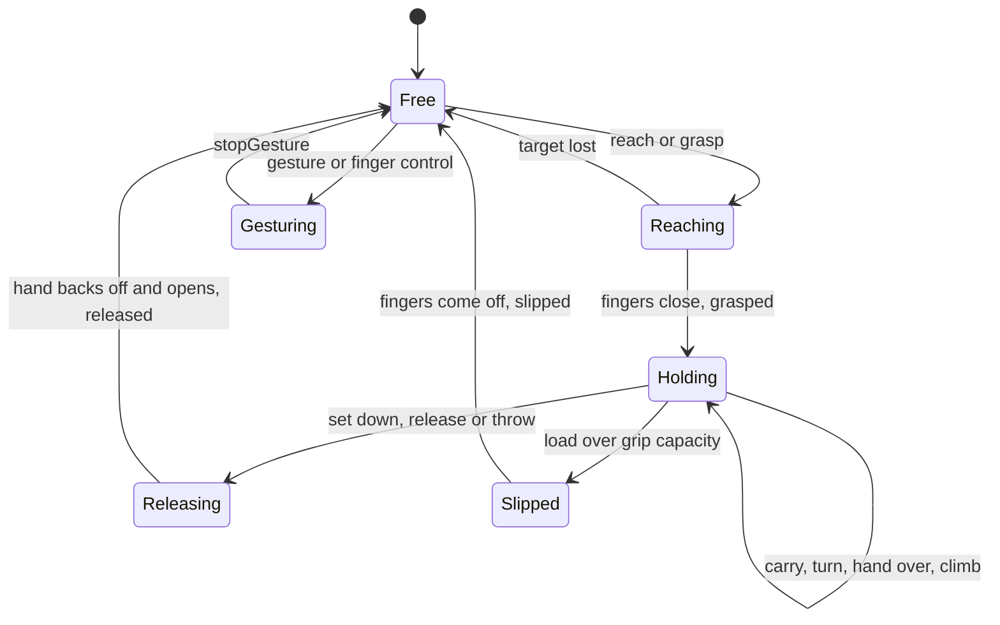

# 25th procedural hands

Procedural human hands and arms for [three.js](https://threejs.org), with no animation files. Every pose, grip and gesture is solved at run time from anatomy (bone lengths, joint limits, finger coupling) and from the shape and size of what the hand is holding. Every length, range and colour comes from a published measurement.

The **library** in [`hands/src`](https://github.com/iam25th1/25th-procedural-hands/tree/main/hands/src) is the product. It imports nothing but three, never touches the DOM, and runs the same in the browser and in Node. This repository also ships an **interaction sandbox**, the demo that exercises every capability, and a small **consumer example** that uses the library from outside itself.

<p align="center"></p>

<!-- VIDEO: 25TH drops a directly uploaded video here (drag the .mp4 into this spot in the GitHub editor). -->
> **Video goes here.** A short capture of the sandbox on a phone, uploaded directly to this README.

| Phone portrait | Phone landscape | Desktop |
| --- | --- | --- |
|  |  |  |

- **Anatomical rig**: 25 WebXR joints per hand, an arm of shoulder, upper arm, forearm and three twist bones, 62 bones in all, every joint held to a sourced range.
- **Control at any level**: named poses, a gesture registry, counting, any set of extended fingers, per finger and per joint curl and spread, arm IK to a wrist target.
- **Grasping and manipulation**: eight grips (tip pinch, pad pinch, tripod, lateral pinch, hook, power cylinder, spherical, palm press), reach planning round obstacles, carry, set down, throw, catch, handover, in-hand roll and spin, slip under load.
- **An interaction layer**: a deterministic physics world of bodies, hinges, sliders, rungs and a rope that the hands push, pull, press, turn, drag and climb.
- **Deterministic**: a fixed 60 Hz step and seeded randomness, so the same calls replay bit for bit.

## Install

```sh
npm install 25th-procedural-hands three
```

three is a peer dependency (`^0.186.0`, the version the library is tested on); nothing else is needed. Until the package is published, install it from the repository (`npm install github:iam25th1/25th-procedural-hands three`) or from a tarball made with `npm pack` in a clone. The package is ES modules only and needs a bundler or an import map for its bare `three` import, as three itself does.

## Quick start

```js
import * as THREE from 'three';
import { create, createThreeView } from '25th-procedural-hands';

const scene = new THREE.Scene();
const hands = create({ seed: 1 });          // the rig: both arms and hands
const view = createThreeView(hands);        // one skinned mesh per arm
scene.add(view.group);

hands.gesture('wave', { hand: 'left' });
hands.count('right', 3);                    // index, middle and ring up

renderer.setAnimationLoop(() => {
  hands.update(1 / 60);                     // wall seconds; steps at a fixed 60 Hz inside
  view.update();
  renderer.render(scene, camera);
});
```

Positions are metres in a frame centred on the eye: x to the right, y up, z toward the viewer, so the hands sit at about z = -0.35. The full, runnable version is [`examples/consumer`](https://github.com/iam25th1/25th-procedural-hands/tree/main/examples/consumer) (about 70 lines):

<p align="center"></p>

## How it fits together



Only `three-view.js` imports three. Everything else is plain modules with no DOM, which is how the whole rig runs under `node --test`. A test in the gate lexes every file under `hands/src` and fails on any other import. [`hands/README.md`](https://github.com/iam25th1/25th-procedural-hands/blob/main/hands/README.md) covers how each part works inside and how to extend it.

## API

`create(options)` returns a `Hands` instance; `hand` is `'left'`, `'right'` or `'both'`.

<details>
<summary>The Hands API</summary>

| Call | What it does |
| --- | --- |
| `create(options)` | Options: `seed`, `reducedMotion`, `targets` (arm targets per hand), `world` (`true` for a fresh physics world, or a `World`), `strength`, `skinTone` |
| `update(dt)`, `step()` | Advance by wall seconds in fixed 60 Hz steps; one step |
| `setPose(hand, pose)` | A named pose from `POSES` |
| `blendPose(hand, pose, weight, { mask })`, `clearBlend(hand)` | Blend a pose over the active one, per digit mask |
| `setFinger(hand, finger, curl, spread)` | Curl 0 to 1 and spread -1 to 1, anatomically clamped, over whatever pose is active |
| `setFingerJoint(hand, finger, joint, curl)` | One joint: `mcp`, `pip`, `dip` (thumb: `cmc`, `mcp`, `ip`) |
| `setThumbOpposition(hand, amount)`, `releaseFingers(hand, finger)` | Thumb opposition; hand a digit back to the pose |
| `count(hand, n, style)`, `showFingers(hand, set)` | Counting 1 to 5, index first or thumb first; any combination of extended digits |
| `gesture(name, { hand })`, `stopGesture(hand)` | Any gesture in the registry (`GESTURES`, `registerGesture`) |
| `setTarget(hand, { pos, rot, pole })`, `moveTo(hand, target)`, `arrived(hand)` | Wrist IK target; `moveTo` routes round anything in the way |
| `grasp(hand, object, grip)`, `release(hand, { velocity })` | Close a grip on a shape, a world body or body part, a prop part, a rung or the rope; let go (a velocity throws) |
| `attach(hand, object)`, `detach(hand)` | Fix an object to the wrist without solving a closure |
| `reach(hand, target, grip, opts)` | Plan and move to a grip pose, the approach clear of obstacles |
| `carry(body, target)`, `intent(hand, target)`, `setDown(hand)` | Carry with one or two hands; drive a held prop; set a held body down on its surface |
| `readyCatch(hand, point)`, `planCatch(hand, body, grip)` | Meet a flying body where it will pass |
| `spin(hand, axis, rate)` | Turn a held object in the fingers |
| `setBody(pos)`, `moveBody(pos, seconds)` | Move the body anchor (hang and climb) |
| `on(event, fn)`, `off(event, fn)` | Events: `contact`, `grasped`, `released`, `slipped` |
| `holding(hand)`, `held(hand)`, `contacts(hand)`, `joint(hand, name)`, `hash()` | State; `hash()` covers the joints and the whole world, for replays |
| `dispose()` | Tear down; later calls fail loudly |

</details>

<details>
<summary>Also exported</summary>

| Export | What it is |
| --- | --- |
| `createThreeView(hands, { lod, skinTone, sleeveColour })` | The three.js view: `group`, `update()`, `setLod('high' \| 'low')`, `recolor({ skinTone, sleeveColour })`, `triangles`, `dispose()` |
| `POSES`, `GESTURES`, `GRIPS`, `OBJECTS`, `COUNTING` | The data the API plays from |
| `MONK_TONES`, `SKIN_TONES`, `skinTone`, `skinPalette` | The ten Monk Skin Tone Scale tones and the palette each gives the mesh |
| `World`, `Body`, `Prop`, `Rope`, `Interaction` | The physics world and the hands acting on it |
| `Skeleton`, `XR_JOINT_NAMES`, `ARM_JOINT_NAMES` | The skeleton and its joint names (WebXR Hand Input names for the hand) |
| `buildArmMesh`, `colorize`, `buildStone`, `buildSachet` | Mesh builders, renderer free |
| `handRotation`, `v3`, `quat`, `m4`, `deg`, `toDeg`, `mulberry32`, `Clock`, `STEP` | Math, the seeded generator and the fixed step clock |
| `dmath` | `sin`, `cos`, `tan`, `asin`, `acos`, `atan`, `atan2`, `exp`, `log`, `pow`, `hypot` as the rig computes them: the same bits on every engine and CPU, where `Math`'s are not |
| `limitMargin`, `penetration`, `objectPenetration`, `handCapsules` | The measurements the tests and checks use |

</details>

## Capabilities

Each hand moves through the same states whatever it works on, emitting `contact`, `grasped`, `released` and `slipped` on the way.



<details>
<summary>All 64 capabilities, each proven by a named check</summary>

| Group | Capabilities |
| --- | --- |
| Fingers | Curl 0 to 1 per finger and per joint; spread; thumb opposition; anatomically clamped; either hand, independently, at any time, over the active pose |
| Counting | 1 to 5 index first and thumb first; any combination from a set or mask (all 32) |
| Gestures | Relaxed, open palm, spread, fist, point, OK, thumbs up, V, beckon, wave, finger drum, pebble roll |
| Grips | Pad pinch, tripod, lateral pinch, hook, power cylinder, spherical |
| Manipulation | Grab, hold under motion, carry, place, release, throw, catch; two hands on one object; handover; in-hand roll and spin |
| Props | Press a button, flip a switch, pull a lever, turn a knob, open and close a drawer, push a crate, drag a crate |
| Climbing | Hang from a rung, climb hand over hand, hold a rope |
| Strength | Grip strength and slip; weight read in the arms |
| Physics | Rigid spheres, boxes and capsules; hinges; sliders; fixed rungs; a rope as a chain of points; hands move objects and objects resist hands; deterministic replay |
| Budgets | Step time in Node and live; the live tail; planning off the frame |

`npm run hands:matrix` prints one row per capability with the check that proves it and the gallery sheet that shows it. Each manipulation is a scripted scenario ([`app/scenes/capabilities.js`](https://github.com/iam25th1/25th-procedural-hands/blob/main/app/scenes/capabilities.js)) with a statement of what it must achieve ([`app/scenes/expectations.js`](https://github.com/iam25th1/25th-procedural-hands/blob/main/app/scenes/expectations.js)); the checks play it frame by frame and fail it if a hand passes into anything, drops what it holds, pops, or does not do what it is for.

</details>

A phalanx capsule (segment $a\,b$, radius $r$) counts as a contact when its surface is within the pad squish of the object's surface, plus 0.3 mm, and a held object slips when holding it through the hand's own motion needs more than its grips can give:

$$ \min_{\mathbf p \in [a,b]} \operatorname{sdf}(\mathbf p) - r \le \delta_{\text{squish}} + 0.3\ \text{mm}, \qquad m\,\lVert \mathbf a + \mathbf g \rVert > \sum_{\text{hands on it}} C_{\text{grip}} $$

with $\delta_{\text{squish}} = 0.45$ mm and the capacities $C$ per grip in `GRIPS` (a pad pinch 16 N, a power grip 160 N).

<details>
<summary>What every scenario is held to</summary>

| Measure | Limit |
| --- | --- |
| Hand into any object, static, prop or rope | 1 mm |
| Finger into finger or palm | 1 mm |
| A gripping digit off what it holds, once the grip has formed | 2 mm |
| A hand off what it follows | 5 mm |
| Joint angular speed | under 20 rad/s |
| Wrist travel per frame | under 4 cm |
| Joint limits | never passed |
| Bodies moving without contact, bodies at rest in the air | none |
| A body set down | held or resting on its surface at every frame, and let go resting |
| Hands attached while climbing | at least one |
| Replay of a 30 s scripted run | identical hashes |

</details>

## Sourced values

Every length, range and colour the rig is built from comes from a published measurement. They are used as data: numbers taken from the tables and figures cited, not reproduced text. Each is cited again beside the value in the code ([`anatomy.js`](https://github.com/iam25th1/25th-procedural-hands/blob/main/hands/src/anatomy.js), [`skin.js`](https://github.com/iam25th1/25th-procedural-hands/blob/main/hands/src/skin.js), [`mesh.js`](https://github.com/iam25th1/25th-procedural-hands/blob/main/hands/src/mesh.js)).

| Source | Used for |
| --- | --- |
| Buryanov A, Kotiuk V. Proportions of hand segments. *Int J Morphol* 2010;28(3):755-758 | Every phalanx and metacarpal length and the fingertip soft tissue (Table I); the finger web heights (Table III) |
| Drillis R, Contini R. *Body segment parameters*. New York University, 1966 (as reproduced in Winter DA, *Biomechanics and Motor Control of Human Movement*) | Upper arm, forearm and hand lengths as fractions of stature |
| ANSUR II, 2012 Anthropometric Survey of US Army Personnel (combined sample, N = 6068) | Hand length and breadth, from which stature and the knuckle spacing follow; wrist circumference; the forearm length it is checked against |
| Cheema TA, Cheema NI, Tayyab R, Firoozbakhsh K. Measurement of rotation of the first metacarpal during opposition using computed tomography. *J Hand Surg Am* 2006;31(1):76-79 | The thumb column's rest rotation, 74 +/- 10 deg, and the method it is measured by |
| Kulesh PN, Fletcher MDA, Solomin LN. Avoidance of external fixation pin induced rotational stiffness in the forearm. *SICOT J* 2015;1:3 | How forearm rotation is shared along the forearm's skin: where the three twist bones sit and what share each carries |
| Yamaguchi Y et al. Mesenchymal-epithelial interactions in the skin. *J Cell Biol* 2004;165(2):275-285 | Why the palm's lighter colour stops at the wrist crease: palmoplantar (glabrous) skin has a fifth of the melanocytes of other sites |
| Monk E. The Monk Skin Tone Scale. SocArXiv, 2023 (doi:10.31235/osf.io/pdf4c), with the colour values Google publishes at skintone.google | The ten skin tones and the swatches the rendered skin is held to |

The whole arm scales from one measured value: stature is implied by the ANSUR II hand length through Drillis and Contini's hand fraction, and every segment follows from it,

$$ H = \frac{L_{\text{hand}}}{0.108} = \frac{189.3\ \text{mm}}{0.108} \approx 1753\ \text{mm}, \qquad L_{\text{upper arm}} = 0.186\,H, \quad L_{\text{forearm}} = 0.146\,H. $$

Forearm rotation is carried by the skin in the shares Kulesh et al. measured: at each of their eight levels the share is $s = \bar d_u / (\bar d_u + \bar d_r)$, from skin displacement against the ulna and against the radius, rising from 0.063 near the elbow to 0.728 at the distal radius. The rig carries it on three twist bones, a piecewise linear fit through levels V and VIII exactly and every other level within 0.025: forearm-twist-1 at level V (share 0.346), forearm-twist-2 at level VIII (0.728) and forearm-twist-3 at the distal radius (1), so the wrist joint itself does not pronate, as the radiocarpal joint does not.

<details>
<summary>Also cited in the code, for joint ranges</summary>

- Ryu JY et al. Functional ranges of motion of the wrist joint. *J Hand Surg Am* 1991;16(3):409-419: wrist flexion, extension and deviation.
- Wheeless' Textbook of Orthopaedics, elbow joint: elbow flexion and forearm rotation.
- AAOS normal values, as listed by goniometer.io: finger and shoulder ranges.
- El-Shennawy et al. 2001: the mobile fourth and fifth carpometacarpal joints.
- B K et al. *Indian J Plast Surg* 2024: finger hyperextension; Physiopedia goniometry: MCP abduction.

</details>

## Skin tones

The hands come in the ten tones of the **Monk Skin Tone Scale**, `monk-1` (lightest) to `monk-10` (deepest), default `monk-8`; `skinTone` also takes a Monk number or any hex. Monk rather than Fitzpatrick because it is a colour scale built to represent the whole human range evenly and publishes its colours; Fitzpatrick sorts skin by how it burns and tans and has no official colours. Each tone has its own undertone, a palm lighter than the back (slightly on the lightest tones, far lighter on the deepest), and a nail bed that stands out against it. The checks render every tone and hold the back of the hand within 2.5 dE of the published swatch.

<details>
<summary>The ten tones</summary>

| Tone | Published | Undertone |
| --- | --- | --- |
| Monk 1 | `#f6ede4` | neutral |
| Monk 2 | `#f3e7db` | neutral |
| Monk 3 | `#f7ead0` | golden |
| Monk 4 | `#eadaba` | golden |
| Monk 5 | `#d7bd96` | golden |
| Monk 6 | `#a07e56` | neutral |
| Monk 7 | `#825c43` | red |
| Monk 8 | `#604134` | red |
| Monk 9 | `#3a312a` | neutral |
| Monk 10 | `#292420` | neutral |

The albedo behind each swatch is fitted for the sandbox's lighting (Khronos PBR Neutral tone mapping at exposure 1.3); with very different lights, paint with `tone.hex` instead. [hands/README.md](https://github.com/iam25th1/25th-procedural-hands/blob/main/hands/README.md#skin-tones) has the model and the calibration.

</details>

## Budgets

Measured by `npm run hands:check` (values from the run on 2026-09-24; limits and the reasons for them in [the spec](https://github.com/iam25th1/25th-procedural-hands/blob/main/docs/dev-notes/HANDS_SANDBOX_SPEC.md#budgets)).

| The library alone | Measured | Limit |
| --- | --- | --- |
| Triangles, both arms, high LOD | 14 504 | 20 000 |
| Triangles, both arms, low LOD | 5 960 | 8 000 |
| Draw calls, both arms | 2 | 6 |
| Bones | 62 | 80 |
| Rig step (one fixed step), median in Node | 0.049 ms | 0.5 ms |

<details>
<summary>With the sandbox scene loaded</summary>

| Budget | Measured | Limit |
| --- | --- | --- |
| Triangles, worst of six stations | 23 786 | 30 000 |
| Draw calls, worst of six stations | 37 | 45 |
| Sim step (script keys, rig, interaction, physics), median in Node | 0.891 ms | 1.2 ms |
| Sim step, median, live in headless Chromium | 2.3 to 2.4 ms (bimodal run to run) | 3.0 ms |
| Sim step, 95th percentile, live | 3.1 to 3.3 ms | 4.5 ms |
| Sim step, worst step, live | 6.5 to 6.6 ms (a new scene's first settling steps) | 16.7 ms |

The live figures are the sandbox's perf overlay figures, read in headless Chromium on the machine running the check, not on a phone; on-device numbers come from the overlay itself.

</details>

## The sandbox (the demo)

The sandbox exercises every capability. It is the demo, not part of the package.

```sh
git clone https://github.com/iam25th1/25th-procedural-hands.git
cd 25th-procedural-hands
npm ci --ignore-scripts        # Node 20 or newer; exact pins, no install scripts
npm run sandbox                # or: PORT=3100 npm start
```

The server prints the sandbox URL on this machine and on the local network (open the LAN one on a phone). Two scenes share one clock (pause, single step, 0.1x, 0.25x, 1x) and seeded randomness:

- **Hands**: the rig alone for inspection: poses, counting, gestures, grips on objects of any size, per joint sliders for all ten digits.
- **Sandbox**: a ledge of objects, a bench for two hands, a panel with button, switch, knob, lever and drawer, a crate, a ladder and a rope, with an action palette and the capability matrix.

<details>
<summary>Using the sandbox</summary>

- **Controls** (or the **C** key) opens the control centre: Actions, Matrix, Joints, Objects, Capture and Settings. **Escape** closes it and **Space** pauses. It docks beside the view, never over the hands, and opening it changes neither the camera nor the field of view.
- **Capture** records video two ways, both saved to your device: **Record video** records the view live; **Render video** replays the action and encodes every frame at 60 fps with WebCodecs at 1920x1080 or 2560x1440. **Record actions** and **Replay actions** record what you do, and replay it exactly.
- **Camera**: touch drags the hand's target; in Move camera mode a drag moves the camera the way you drag. Settings has Invert X, Invert Y and sensitivity. The camera moves only from your input, and there is a reduced motion setting that follows the system's.
- **Planning off the main thread**: where a hand grips and which way it comes in are searches that can take a second on a phone. A planning worker runs its own copy of the simulation two steps ahead and answers them, from a recorded plan table while an action is on its script; the page never solves on its own thread.
- **Shot mode** renders any frame from URL parameters, which the gallery uses: `/?shot=1&scene=sandbox&cap=throwCatch&t=2.45`.

The server serves only whitelisted files under a strict Content Security Policy: no inline scripts, no eval, workers only from the same origin.

</details>

## The consumer example

```sh
npm --prefix examples/consumer ci --ignore-scripts
npm run example                # Vite prints the URL
```

[`examples/consumer`](https://github.com/iam25th1/25th-procedural-hands/tree/main/examples/consumer) is a fresh three.js scene that imports the library by its package name, the way an installed consumer does. It uses Vite because bare imports need a bundler or an import map, and an import map is an inline script, which this repository's pages do not use.

## Checks

The browser checks need Playwright's Chromium, which `--ignore-scripts` does not download: `npx playwright install chromium`.

| Command | What it does |
| --- | --- |
| `npm run check` | Parses every source folder and scans for characters the house style bans |
| `npm test` | `node --test`: the library, physics, server and isolation tests |
| `npm run hands:check` | The acceptance suite: every check with its worst measured value against its limit |
| `npm run hands:matrix` | The capability matrix: one row per capability, PASS or FAIL |
| `npm run hands:plans` | Rebuilds the recorded plan table (after any change to `hands/src` or `app/scenes`; `hands:check` fails while it is stale) |
| `npm run hands:gallery` | Renders the gallery sheets at 390x844, 844x390 and 1440x900 into `artifacts/gallery/` |
| `npm run gate` | check, test, hands:check, hands:matrix and `npm audit --audit-level=high`: every commit passes it |

GitHub Actions runs the same gate on every push and pull request to main, on Linux and macOS ([`.github/workflows/gate.yml`](https://github.com/iam25th1/25th-procedural-hands/blob/main/.github/workflows/gate.yml)).

## Repository

| Path | What is there |
| --- | --- |
| [`hands/`](https://github.com/iam25th1/25th-procedural-hands/tree/main/hands) | The library ([internals and how to extend it](https://github.com/iam25th1/25th-procedural-hands/blob/main/hands/README.md)) and its tests |
| [`examples/consumer/`](https://github.com/iam25th1/25th-procedural-hands/tree/main/examples/consumer) | The consumer example |
| `app/`, `server/` | The sandbox and its static dev server |
| `scripts/`, `test/` | The checks, the matrix, the gallery and the repository tests |
| [`docs/dev-notes/`](https://github.com/iam25th1/25th-procedural-hands/tree/main/docs/dev-notes) | Development notes: the build brief, why the arms and thumbs looked twisted and how each cause was fixed, known minor issues |

[CONTRIBUTING.md](https://github.com/iam25th1/25th-procedural-hands/blob/main/CONTRIBUTING.md) has the rules that matter here: every anatomical value cited, no check loosened to make a row pass, the gate green before a pull request.

## Licence and credits

MIT ([`LICENSE`](https://github.com/iam25th1/25th-procedural-hands/blob/main/LICENSE)), copyright 2026 25TH.

three.js (copyright three.js authors) and anime.js (copyright Julian Garnier) are MIT licensed; the library needs only three, and anime.js is used by the sandbox alone. The sandbox's fonts are vendored in `app/fonts` under the SIL Open Font License 1.1: **Alfa Slab One** by JM Solé and **Barlow Condensed** by Jeremy Tribby, via Fontsource; the licence texts are in `app/fonts/OFL-*.txt`.
