# Why the arms and thumbs looked twisted

Every automated check passed while the arms and thumbs still looked twisted by eye. The checks measured the bones, and the bones were not the problem. This page records what was measured on the rendered skin and the skeleton, the sources behind each anatomical value, what was fixed, and three fixes that were first held as patches because they failed existing checks. All three have landed: the palm colour and the pronation distribution with those checks corrected against their sources, and the thumb's rest roll once the planner and the set-down were fixed.

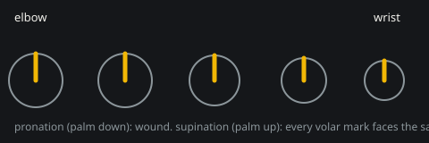

> **Media placeholder:** a screen recording of the forearm turning from full pronation to full supination, before and after, goes here.

## What was measured

All renders were made with the single arm shot scene (`/?shot=1&scene=arm&pose=relaxed&cam=palm|back|side|ulnar&pron=<deg>`), so before and after share framing and lighting.

| # | Cause | Measure | Before | Source | State |
| --- | --- | --- | --- | --- | --- |
| 1 | Forearm skin laid down unwound in full pronation | volar side against the elbow crease (bind) and the palm (supination), skinned mesh | 180 deg off at the elbow; 129, 80, 27 deg off at 28, 55, 85 percent in supination | Kulesh et al 2015 | **fixed** (e7eae3f) |
| 2 | Palm colour on the volar forearm | volar against dorsal forearm colour, every Monk tone | 6.7 dE76 | Yamaguchi et al 2004 | **fixed**: palm colour on glabrous skin only (0.07 dE76) |
| 3 | Thumb column under-rotated at rest | first metacarpal rotation, measured as Cheema et al measured it | 41.6 deg | Cheema et al 2006: 74 +/- 10 | **fixed**: 74.1 deg |
| 4 | Wrist crease ring weighted against its neighbours | ring turn under 90 deg of rotation, bend under 73 deg of flexion | turn 75 against 86 either side; bend 36 against 65 | (mesh consistency) | **fixed** (88b598b) |
| 5 | Forearm skin turned in equal thirds, a third on the wrist joint | ring turn against Kulesh's per-level share | 0.56 of the hand's turn at 55 percent of the forearm (Kulesh 0.34); 0.86 at 85 percent (0.63) | Kulesh et al 2015, Tables 1 and 3; the radiocarpal joint does not pronate | **fixed**: three twist bones at the sourced shares, none on the wrist |
| 6 | Wrist thin | wrist ring perimeter | 156.6 mm against 169.0 | ANSUR II | **fixed** (8096e5d) |

### Ranking

1. **Forearm spiral (1 and 2 together).** This dominates wherever the forearm is turned away from the bind pose. That is the median sandbox pose (68 deg away) and every Hands scene pose (hands raised palms to the eye, a full 180 deg away). Cause 1 wound the skin the wrong way, and cause 2 painted the wound part with the palm's colour, so the spiral read as a stripe from wrist to elbow.
2. **Thumb (3).** It shows in every pose, since every thumb pose inherits the rest frame. The nail faced mostly dorsal (its normal 0.70 dorsal, 0.71 radial) instead of radially.
3. **Wrist band (4).** A backward twist band of 11 deg at 90 deg of rotation, 22 deg at 180.
4. **Candy wrap (5).** Linear blend skinning between twist bones 60 deg apart (a 180 deg turn) shrinks the mid forearm to 87 percent of its radius.
5. **Proportion (6).** It reads as thin, not twisted.

Forearm skin under rotation, before any fix (linear blend skinning in Node)

| Ring (fraction from the elbow) | 90 deg from bind: turn, radius | 180 deg from bind: turn, radius |
| --- | --- | --- |
| 0.28 | 25 deg, 98.2 % | 51 deg, 93.0 % |
| 0.55 | 50 deg, 96.9 % | 100 deg, 87.9 % |
| 0.85 | 77 deg, 96.6 % | 153 deg, 86.7 % |
| 0.95 | 86 deg, 98.4 % | 173 deg, 93.8 % |
| wrist crease | 75 deg, 96.6 % | 150 deg, 86.6 % |
| palm, 12 mm past | 86 deg, 98.3 % | 172 deg, 93.4 % |

The winding: each forearm ring is laid down turned back by the share of the half turn it does not carry,

$$\alpha(f) = (1 - s(f))\,\pi, \qquad s(f) = \frac{\sum_i w_i(f)\,\tau_i}{\sum_i w_i(f)}$$

where $w_i$ are the ring's skin weights and $\tau_i$ each bone's share of the forearm's rotation (0 for the elbow and upper arm, 1/3, 2/3 and 1 along the twist chain).

## Renders, before and after

Each image has the before row on top and the after row below, with the same framing and lighting.

| Change | Views | Image |
| --- | --- | --- |
| Recon: the thumb at rest (palmar, dorsal, radial, ulnar) | four views, before any change | 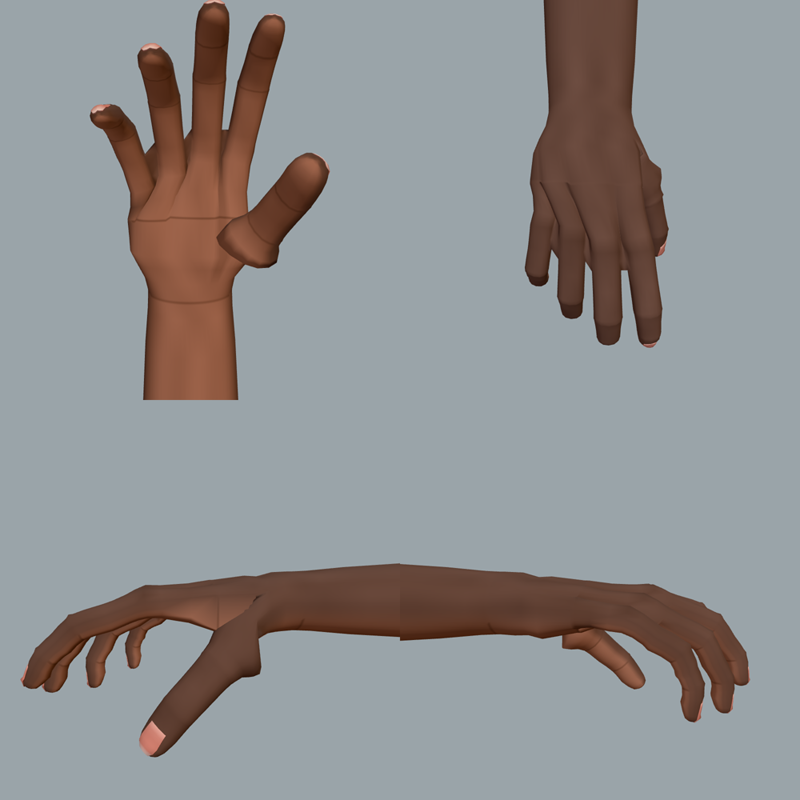 |
| Recon: the forearm at 90, 0 and -90 deg | before any change | 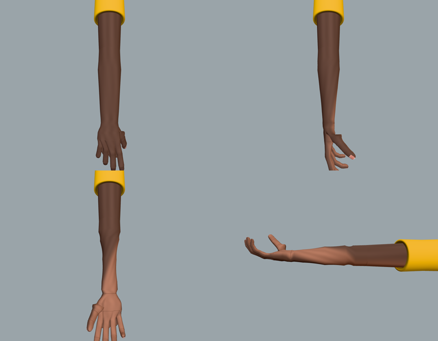 |
| Wrist weights (88b598b) | thumb up; full supination from above and below | 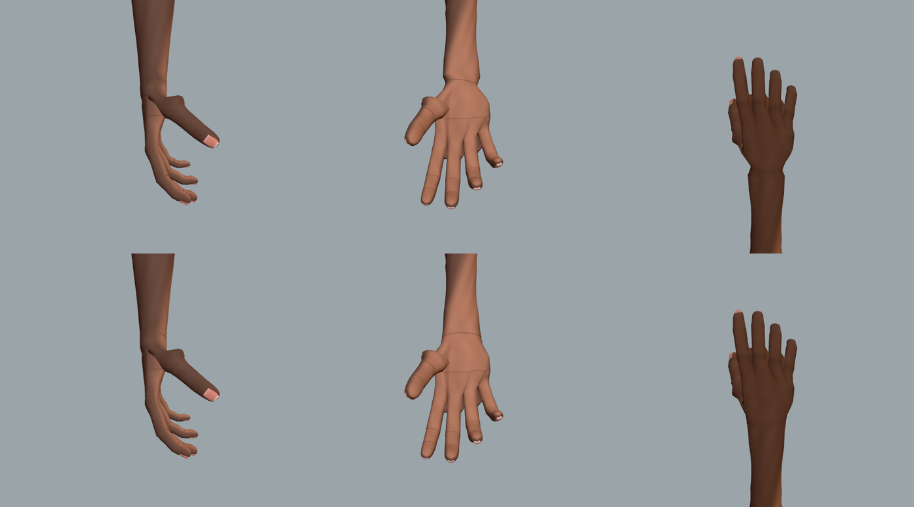 |
| Forearm winding (e7eae3f) | bind from above and below; thumb up; full supination | 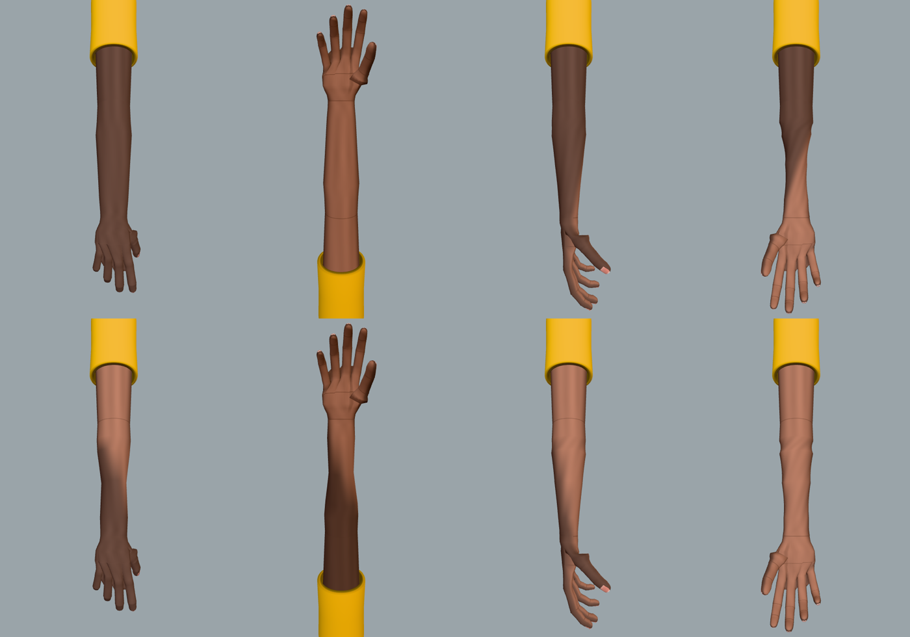 |
| Wrist girth (8096e5d) | bind; thumb up from the side; full supination | 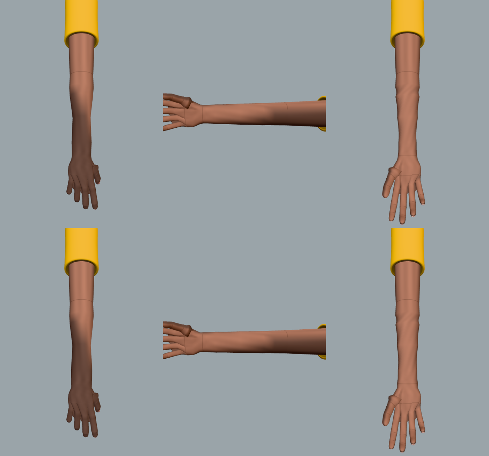 |
| Pronation on three twist bones in Kulesh's shares (landed) | back at 90, 0 and -90 deg; palm and side at -90 | 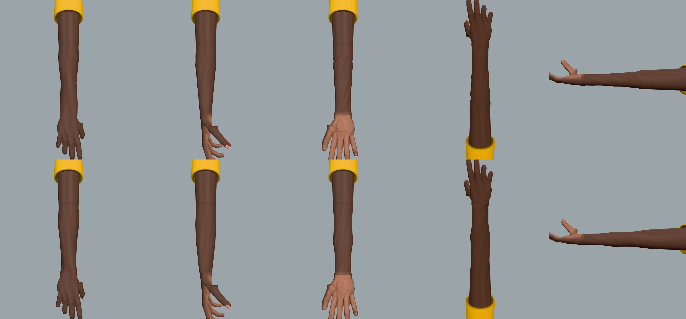 |
| Thumb roll (landed) | palm, back, radial, ulnar, three quarter | 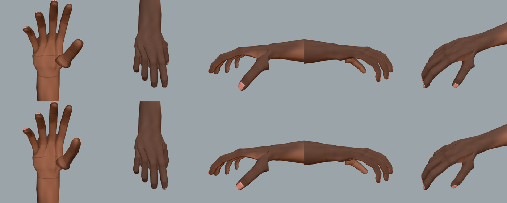 |
| Glabrous colour (landed) | bind from above and below; thumb up; full supination | 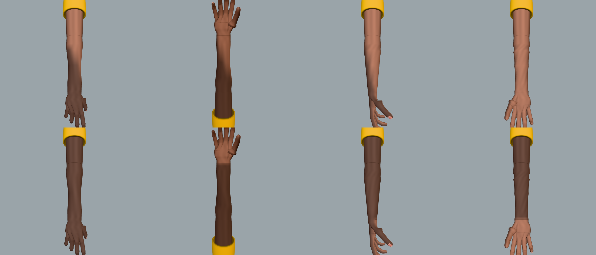 |
| Gallery: counting, desktop | the core sheet before and after the three commits | 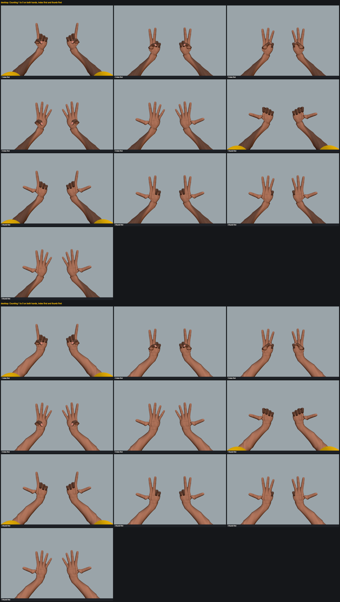 |

## Sources

- Cheema TA, Cheema NI, Tayyab R, Firoozbakhsh K. Measurement of rotation of the first metacarpal during opposition using computed tomography. *J Hand Surg Am* 2006;31(1):76-79. doi:10.1016/j.jhsa.2005.08.016. They measured the angle between the dorsal tangent of the 2nd and 3rd metacarpals and the line through the first metacarpal head at the sesamoids. It is 54 +/- 10 deg in retroposition, 74 +/- 10 at rest, and 100 to 110 in opposition.
- Cooney WP, Lucca MJ, Chao EY, Linscheid RL. The kinesiology of the thumb trapeziometacarpal joint. *J Bone Joint Surg Am* 1981;63(9):1371-1381. The trapezium sits at 48 deg flexion, 38 deg abduction and 80 deg pronation to the third metacarpal. It is supporting context only: the rig's thumb direction (24 to 32 deg palmar out of the palm plane) has no source and was not changed.
- Kulesh PN, Fletcher MDA, Solomin LN. Avoidance of external fixation pin induced rotational stiffness in the forearm. *SICOT J* 2015;1:3. doi:10.1051/sicotj/2015005. Cadaver skin displacement at 70 deg of rotation: least against the ulna near the elbow, and least against the radius in the distal third (40 to 88 mm proximally, 7 to 23 mm distally).
- Yamaguchi Y et al. Mesenchymal-epithelial interactions in the skin. *J Cell Biol* 2004;165(2):275-285. doi:10.1083/jcb.200311122. Melanocyte density in palmoplantar skin is a fifth of other sites'.
- ANSUR II (2012), combined sample, N = 6068, means computed from the public data file:

  | Measure | Mean (mm) | SD |
  | --- | --- | --- |
  | Wrist circumference | 169.0 | 13.1 |
  | Forearm circumference, flexed | 295.0 | 30.0 |
  | Radiale to stylion | 259.2 | 19.8 |
  | Acromion to radiale | 327.4 | 20.7 |
  | Stature | 1714.4 | |

## The fixes that were held

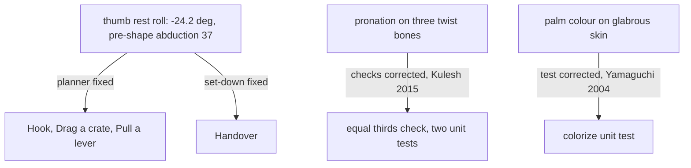

### Landed: the thumb's rest roll

This rolls the thumb column -24.2 deg about its own axis, so the relaxed pose measures 74.1 deg by Cheema's method (was 41.6). It also sets the power-grip pre-shape's CMC abduction to 37, the joint's limit; it was authored at 40, past the limit. The check `anatomy: first metacarpal rotation at rest` failed the rig before it (41.6) and passes with it (74.1 on both hands).

With the roll alone, Hook, Drag a crate, Pull a lever and Handover failed, plus four aggregate rows. Each was traced to its cause and fixed:

| Scenario | Cause | Fix |
| --- | --- | --- |
| Drag a crate, Hook | `preShape` scaled every grip's pre-pose until the thumb-to-index tip gap matched the object's aperture, the hook included. The hook places its handle against the index proximal phalanx of that scaled pose, so rolling the thumb moved the placement, and the flat arriving fingers came down on the handle (index proximal 2.4 mm into it) and lifted the crate 2 cm before the grip closed | A grip without the thumb (hook, press) keeps its pre-pose as authored. Grip scoring now also checks the grip's arrival shape (a hook arrives flat), which it never did |
| Pull a lever | The rolled thumb takes the lever differently, so the hand lets go closer to the body. From there none of the route planner's detours home was clear; its best still ran the ring finger 20.9 mm into the knob beside the lever | Two routes added last in the list: across at the current depth then straight to the goal, and the reverse. A clear route earlier in the list is still taken first |
| Handover | The left hand set the handle down with its thumb and fingers under it, so it stopped 20 mm above the bench; let go, it rested on the thumb and rolled off. The rig without the roll did the same and passed only because its slowest sampled speed was 0.028 m/s against the floating check's 0.02 | The set-down (see [the spec](HANDS_SANDBOX_SPEC.md#set-down)): the hand turns the handle as it lowers so it lands before any digit (here rolled 75 deg and tipped 20 deg, 5 cm aside on the bench), and lets go thumb first |

Denser transit sampling (below) was also tried and not kept. With the roll, the set-down also had to allow for an opposed thumb: wrapped round a handle, some of it is under the handle at any turn, so "not under" is judged on the thumb's axis, and a set-down that cannot keep the thumb out lets go with the thumb left where it is while the hand slides off level along the handle.

The visible effect of the roll alone is modest. The pad turns toward the fingers and the nail faces radially. The column's direction out of the palm is unchanged, because it has no source.

### Landed: pronation on three twist bones, in Kulesh's shares

The held patch put pronation on two twist bones, half each, and required the distal third of the forearm to turn at least 90 percent with the hand. Reading Kulesh's tables in full contradicted that. Skin displacement against the ulna and against the radius at each of the eight levels gives the skin's share of the hand's turn, $\bar d_u/(\bar d_u+\bar d_r)$: 0.063 at the radial neck rising to 0.728 at the distal radius. So the distal forearm does not turn with the hand, and the equal thirds turned the skin too early rather than too late (0.56 at 55 percent of the forearm against 0.34). The recon's claim that the distal third should turn with the hand was wrong.

What landed instead: three twist bones at 0.5625 (share 0.346), 0.9375 (0.728) and the distal radius (1), and the wrist joint's pronation at 0. Every ring turns within 0.021 of Kulesh's share. Candy wrap improved rather than worsened: the narrowest section of the rendered surface at 180 deg keeps 83.1 percent of its radius, against 79.2 under equal thirds. (The recon's 87 and 74 percent were ring vertices only; the facets between rings narrow further.) Dual quaternion skinning was not needed and was not chosen. It would remove the blend narrowing but not the facet narrowing between rings, and it would replace three.js's skinning shader for every bone of the hand.

Hang from a rung (the thumb metacarpal 14.1 mm into the rung under the held patch) was traced and passes. The reach planner scored the forearm's room to follow on `forearm-twist-1`'s channel alone, so the room's scale followed the bone split: the patch's halves doubled it, which changed the arm pose chosen. With that pose, the transit check's six samples straddled the rung and a route straight through it passed (reproduced, and confirmed by restoring the old scale on the patch tree, which passes). The room is now read off the whole pronation, whatever the split, at the weight it always had: a third. The sparse transit sampling itself is listed under findings not fixed.

### Landed: palm colour on glabrous skin only

The palm's lighter colour now stays on glabrous skin: the palm and the volar digits, stopping at the wrist crease. The volar forearm keeps the forearm's colour, which removes the stripe that made the forearm spiral visible in every rotation. `colour: the palm colour stops at the wrist crease` measured 6.7 dE76 before and 0.07 after.

The unit test `colorize: on every Monk tone the palm is lighter than the back` counted every palmar-facing skin vertex as "palm", the volar forearm included, so it encoded the defect. It now counts glabrous skin only, with every assertion kept; the old and new assertion are in [the spec](HANDS_SANDBOX_SPEC.md#anatomical-values-and-corrected-checks).

It also explains the rendered skin-tone drift. The winding commit (e7eae3f) turned the palm-coloured volar forearm into the edge of the back view the skin-tone check samples, so deep tones' backs rendered lighter (Monk 10 back L* 14.6 to 16.6; worst dE76 1.20 to 2.43). With the forearm coloured as forearm the worst is back to 1.4.

## Checks added

| Check | Committed | Would have caught |
| --- | --- | --- |
| skinning: forearm and wrist skin turn and bend toward the hand in order | yes | the wrist crease ring turning 12.1 percent and bending 38.4 percent less than the ring before it |
| skinning: forearm skin wound as the forearm is | yes | the forearm's volar side 180 deg off the elbow crease at bind, and spiralled in supination |
| proportion: forearm length and wrist girth within half an SD of ANSUR II | yes | the wrist at 156.6 mm against 169.0 |
| anatomy: first metacarpal rotation at rest (Cheema 2006) | yes | the thumb at 41.6 deg against 74 +/- 10 |
| skinning: the distal third of the forearm turns with the hand | in pronation-split.patch | a third of pronation at the wrist joint (85 percent at 85 percent of the forearm) |
| colour: the palm colour stops at the wrist crease | yes | the palm colour painted up the volar forearm (6.7 dE76) |
| ik: forearm rotation shared over the three twist bones in the parts the forearm skin carries it (replaces the equal-thirds check) | yes | a third of every rotation on the wrist joint |
| skinning: forearm skin turns along the forearm as Kulesh 2015 measured it | yes | equal thirds: 0.56 of the hand's turn at 55 percent of the forearm against Kulesh's 0.34 (0.22 off, limit 0.05) |
| skinning: the forearm keeps its girth from full pronation to full supination | yes | candy wrap deeper than the equal-thirds rig's 79.2 percent (the held two-bone patch would have reached it) |

## Two mesh faults found alongside

- The thumb's cuff at the MCP (a knuckle ring and a crease band where the taper turned sharply) is fixed; see [the spec](HANDS_SANDBOX_SPEC.md#mesh-fixes) and the renders in `assets/mesh/thumb-shape.png` (before above, after below; palm, back, radial, ulnar).
- The far sleeve's jagged end (the skin coming out through the sleeve's shoulder dome) is fixed; renders in `assets/mesh/sleeve-*.png` at the three viewports.
- The thumb at rest before and after the roll, four views: `assets/twist/thumb-rest.png`.

## Findings not fixed

- **Transit sampling in the reach planner.** `solveTransitCost` samples a leg at six points, 6 cm apart on a 35 cm leg, so a hand can pass straight through a 32 mm rung between samples. This is how the held pronation patch put the thumb metacarpal 14.1 mm into the rung in Hang. Sampling every 1.5 cm catches it, but it changes route choice elsewhere (Hang on the way home 23 mm, a missed lever grasp), because the arm's springs cut the corners of the planned legs. Fixing it needs the planner to check the path the arm will actually take.
