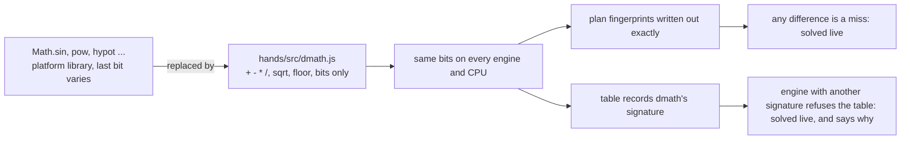

# Why a replay parted from its live run on x64

The first CI run on linux-x64 failed the plans check. The inHandSpin scenario, replayed from the recorded plan table, ended somewhere other than a fresh live run on the same machine. The table had been built on darwin-arm64. This note records what was measured, what the cause was, what changed, and the checks that now catch it.

> **Media placeholder:** a side-by-side screen recording of In-hand spin on an x64 machine, before and after the fix, goes here.

## The cause, in one paragraph

ECMA-262 leaves `Math.sin`, `cos`, `tan`, `asin`, `acos`, `atan`, `atan2`, `exp`, `log`, `pow` and `hypot` implementation-approximated. Section 21.3.2 says "an implementer should be able to use the same mathematical library for ECMAScript on a given hardware platform that is available to C programmers on that platform". V8 does this, and the last bit differs between platforms. Node on linux-x64 disagrees with darwin-arm64 in 9 of these functions, and linux-arm64 in 4. The rig used them throughout. The grasp solve returned slightly different values from identical inputs, and the later solves' inputs then differed by a few units in the last place. The plan fingerprint rounded inputs to 1e-7, so those inputs still matched the recording, and x64 replayed arm64's answers. It was **arithmetic differing between platforms, hidden by a fingerprint rounded coarsely on purpose**. No fingerprint collided or went missing, and the Node version made no difference.

## How it was found

A diagnostic ran every scenario three ways on each machine: live, live through a logging recorder, and replayed from the committed table. It compared the exact bits of the whole state at every frame, and logged every solve's raw input string and answer. It ran on this Mac and in CI on linux-x64 (Node 24.18.0 and 24.21.0), linux-arm64 and darwin-arm64. Separately, a probe computed each `Math` function the rig uses on 50000 seeded inputs and compared the result bits across machines.

The Math functions, bit for bit against darwin-arm64 (this Mac), 50000 inputs each

| Function | darwin-arm64 (CI) | linux-arm64 | linux-x64 |
| --- | --- | --- | --- |
| `sin` | 0 differ | 0 differ | 308 differ, max 1 ulp |
| `cos` | 0 | 0 | 221, 1 ulp |
| `tan` | 0 | 11, 1 ulp | 547, 1 ulp |
| `asin` | 0 | 0 | 701, 1 ulp |
| `acos` | 0 | 0 | 288, 1 ulp |
| `atan` | 0 | 85, 1 ulp | 56, 1 ulp |
| `atan2` | 0 | 115, 1 ulp | 90, 1 ulp |
| `exp` | 0 | 0 | 22, 1 ulp |
| `pow` | 0 | 77, 1 ulp | 77, 1 ulp |
| `hypot` (2 and 3 values) | 0 | 0 | 0 |
| `sqrt` | 0 | 0 | 0 |

For example, `sin(6.9831979912705719)` is `0.64422738851376093` on darwin-arm64 and `0.64422738851376105` on linux-x64. The inputs were identical on every machine. `hypot` agreed everywhere in V8, but the standard does not require it to, and other engines may differ.

inHandSpin, solve by solve: this Mac against linux-x64

| Solve | Kind | Frame | Input | Answer |
| --- | --- | --- | --- | --- |
| 0 to 15 | reach, pre-shape, path and transit costs | 0 | identical | identical |
| 16 | `grasp` | 63 | **identical** | **6 values differ, max 5.55e-17** |
| 17 | `setDown` | 222 | 3 numbers differ, max 5.55e-17 | 1 value differs, max 1.11e-16 |
| 18 | `easeGrip` | 255 | 13 numbers differ, max 8.05e-16 | identical |
| 19 to 33 | path and transit costs | 268 to 324 | 5 to 13 numbers differ, max 8.9e-16 | some differ by up to 4.4e-16 |

Solve 16 is the evidence. Its inputs are byte for byte the same on both machines, yet the grasp solver returns different values, so the difference comes from the arithmetic inside it. Nothing before it differs. The values it returned did not move the hand until the set-down read them at frame 222. The replay's state first differs from x64's own live run at frame 225, in 44 values, the largest 1.1e-16 (a rotation component of the right index metacarpal). By the last frame, 355, that has grown to 1.6e-4, in a rotation component of the dowel (about 0.02 deg).

The size of a difference is measured in ulps, units in the last place. For two doubles $a$ and $b$ of the same sign it is

$$ \operatorname{ulps}(a, b) = \lvert \operatorname{bits}(a) - \operatorname{bits}(b) \rvert, $$

the distance between their bit patterns read as integers: 1 ulp is the smallest step a double can take.

Every scenario, before the fix

| Machine | Runs whose answers differ from the table | Replays that part from live |
| --- | --- | --- |
| darwin-arm64, this Mac and CI | 0 of 48 | none |
| linux-arm64 | 4 of 48 | throwCatch with reduced motion (from frame 142, 3.3e-15 at the end) |
| linux-x64, Node 24.18.0 or 24.21.0 | 22 of 48 | inHandSpin (from frame 225, 1.6e-4 at the end); throwCatch with reduced motion (from frame 142, 3.3e-15) |

The player never stopped on any machine, because every fingerprint matched. Most differing answers changed nothing downstream. Why inHandSpin grew and the others did not was not measured. The likely reason is that the spin keeps turning a held body in the fingers for 1.9 s, and each step's contact solve feeds a last-bit difference in the rotation into the next. The throwCatch reduced-motion run was not caught for two reasons: the plans check replayed only runs with reduced motion off, and it compared `hands.hash()`, which rounds every value to 1e-6 before hashing.

## What an x64 visitor saw

The sandbox serves the table to every visitor. In the browser, the planning worker and the page run the same engine on the same machine, so they always agreed with each other: nothing parted, the page never solved on its own thread, and nothing fell back to live planning. On x64 the worker answered from the table wherever the rounded fingerprint matched, which was everywhere. So the visitor watched a run driven by answers recorded on arm64. It was not the run the checks had audited. It came within 1.6e-4 of the machine's own live run in inHandSpin, which is invisible, and 3.3e-15 in throwCatch with reduced motion. Every other run was identical. No pose was wrong, but no check had ever measured the run the visitor saw. The same held for linux-arm64 and, since the standard allows it, any engine with its own maths library.

## The fix

- **`hands/src/dmath.js`** provides sin, cos, tan, asin, acos, atan, atan2, exp, log, pow and hypot. They are ported from musl and FreeBSD msun (fdlibm), using only operations the standard fixes exactly: `+ - * /`, `Math.sqrt` (the correctly rounded root), `floor`, `abs`, and bit access through a big-endian `DataView`. Every conforming engine computes them bit for bit alike. Against V8's own `Math`, over 200000 seeded inputs each, they are within 1 ulp (tan and hypot 2). The exception is pow, computed as $e^{\,y \ln x}$: within 4 ulp for most inputs and up to 35 where $\lvert y \ln x \rvert$ is large. It serves only mesh shape and colour. Every such call in `hands/src`, `app/scenes` and `app/plan` goes through `dmath`, and the package exports it.
- **Exact fingerprints.** A solve's fingerprint is its inputs written out in full. ECMA-262's `Number::toString` gives the shortest string that reads back to the same double, so equal fingerprints now mean equal inputs. With the math the same everywhere, a difference of one bit means the run has parted from its recording. The recorded answer is then not this run's answer, so that solve and every later one run live. Rounding to 1e-7 was right only while engines disagreed, and it is what let a wrong answer through.
- **A guard at load.** The table records `dmath`'s signature: fixed inputs through every function, with the result bits hashed. `setPlanTable` refuses a table whose signature this engine does not reproduce. Every plan is then solved live, and the page's `plansNote` says why. This makes the fallback both safe and detectable on an engine that breaks the standard, for example one that rounds twice through x87 registers.

Verified in CI on linux-x64, linux-arm64 and darwin-arm64 before the fix reached main. Every scenario, with reduced motion off and on (48 runs), replayed bit for bit on each: every solve's answer and every frame's state equalled the live run, and each machine computed signature `045fd281eb106`.

## The checks that now catch it

| Check | What it would have caught |
| --- | --- |
| `determinism: the rig, the world, the scenarios and the planner use only the Math the standard fixes exactly` | Any `Math.sin`, `pow`, `hypot` and so on, or `**`, in simulation code. It is static, so it runs anywhere |
| `determinism: this engine computes dmath to the recorded bits` | An engine or CPU that computes `dmath` differently. CI runs it on x64 and arm64 Linux and arm64 macOS |
| `plans: ... reduced motion off and on, ends bit for bit where the live run does at every frame` | Any replay that parts from its live run by one bit at any frame, both motion settings, now in CI on all three platforms |
| `test/dmath.test.js` | `dmath` accuracy, special values, the signature, the static rule on known bad code, and the 5.55e-17 case as a regression |

Not confirmed

- Browsers other than Chromium (Firefox and Safari) were not run. They follow the same standard, so `dmath` should give them the same bits. If one does not, it refuses the table and plans live, and says so in `plansNote`. The manual check: open the sandbox in Safari and Firefox, then run `window.__handsApp.plansNote` in the console. It should be empty, and `window.__handsApp.plansLoaded` should be `true`.
- Intel Macs (darwin-x64) and Windows were not run. The CI runners cover x64 through Linux.

