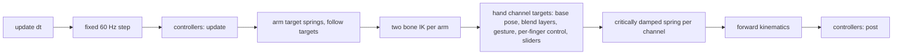
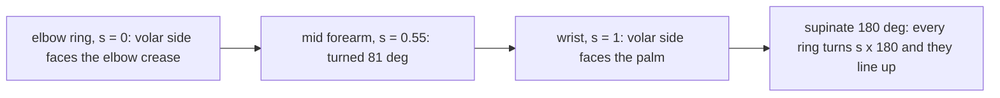
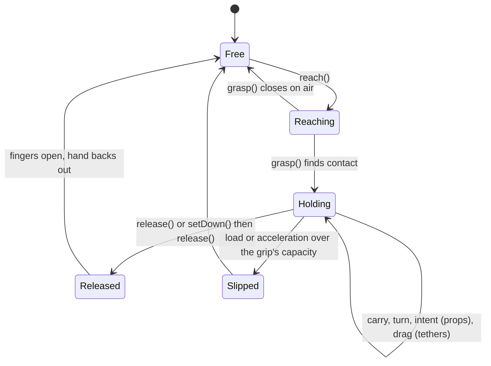

# hands: module internals

The procedural hand and arm library that lives in `hands/src`. It imports nothing but `three` (only `three-view.js` does, for rendering) and never touches the DOM, so every line runs under `node --test`. The repository README covers what the library is for and how to run the sandbox; this file covers how it works inside and how to extend it.

Units are metres, kilograms and seconds. Angles are radians in code and degrees in data tables.

## Files

| File | What it owns |
| --- | --- |
| `index.js` | The public API: `create()` returns a `Hands` instance; re-exports the building blocks |
| `rig.js` | `Rig`: skeleton plus solvers, pose layers, per-finger control, springs, IK per step, controllers |
| `skeleton.js` | 30 joints per side: shoulder, upper arm, forearm, two twist bones, the 25 WebXR hand joints |
| `anatomy.js` | Every length, limit and coupling ratio, each with its source |
| `fingers.js` | Pose to channel resolution, natural coupling, per-finger curl and spread mapping |
| `poses.js` | Named hand poses as per joint data in degrees |
| `grasp.js` | Grip taxonomy, pre-shape, closure to contact, object placement and attachment |
| `ik.js` | Two bone arm IK with a pole, reach clamping, pronation shared in thirds |
| `springs.js` | Critically damped springs and the under damped oscillator |
| `mesh.js` | Lofted skinned arm and hand mesh, skin weights, vertex colour |
| `three-view.js` | `createThreeView`: one `SkinnedMesh` per arm for a three.js scene |
| `gestures.js` | The gesture registry (data) and the interpreter that plays an entry |
| `selfcontact.js` | Thumb and neighbouring finger guards that keep transitions from passing digits through each other |
| `measure.js` | Limit margins, self-penetration and object penetration, shared by tests and checks |
| `stones.js` | Procedural pebbles, rocks and the sachet |
| `clock.js`, `rng.js`, `math.js` | Fixed step clock, seeded generator, dependency free vector and quaternion math |
| `defaults.js` | Default skin tone, sleeve colours and object presets, all overridable |
| `skin.js` | The ten Monk Skin Tone Scale tones and the palette each gives the mesh: dorsal, palm, nail bed, lunula and free edge |
| `physics.js` | `World`: deterministic rigid bodies (sphere, box, capsule), statics, one degree of freedom props (hinge, slider), ropes, hand capsule contacts, tethers |
| `interact.js` | `Interaction`: the hands acting on a world: reach planning, grasp, hold, carry, set down, release, throw and catch, slip, weight, props, drag, climb |

## One step

Every animated channel goes through a critically damped spring, stepped with its exact closed form so the result is repeatable bit for bit:

$$\ddot x = -\omega^2 (x - x_t) - 2\omega\,\dot x$$

## Per-finger control

`setFinger(hand, finger, curl, spread)` and `setFingerJoint(hand, finger, joint, curl)` put a digit under direct control. Curl 0 to 1 maps onto each joint's flexion range from `anatomy.js`, spread -1 to 1 onto MCP abduction. The control blends in over whatever pose is active through its own spring weight, so a finger can be driven while a gesture plays on the rest of the hand. Fingers that are not under control follow a controlled neighbour by the enslaving fractions in `COUPLING.enslave`, which is what keeps a curled ring finger from leaving the little finger perfectly straight. `releaseFingers` hands the digit back to the pose.

Joint mapping

| Digit | Joint | curl 0 | curl 1 |
| --- | --- | --- | --- |
| index to little | MCP | 0 deg | 90 deg |
| index to little | PIP | 0 deg | 100 deg |
| index to little | DIP | follows PIP at 2/3, or 0 to 90 deg when set | |
| thumb | CMC | sweep -12 deg, palmar abduction -12 deg | sweep 48 deg, palmar abduction 10 deg |
| thumb | MCP | 0 deg | 60 deg |
| thumb | IP | 0 deg | 88 deg |

## Counting and finger sets

`count(hand, n, style)` shows 1 to 5 counted from the index (`'index'`) or from the thumb (`'thumb'`). `showFingers(hand, set)` extends any combination of digits, so "middle only" is `showFingers('right', ['middle'])` and "index and little" is `showFingers('left', ['index', 'little'])`. Both generate a pose from the set (`fingerSetPose` in `poses.js`): extended fingers straight with a natural spread and held straight on purpose (active extension keeps only 30 percent of the enslaving pull from a folded neighbour), folded fingers curled as in a fist, and a folded thumb rested on the nearest run of folded fingers by the same coordinate descent the fist uses. Every one of the 32 combinations is checked by `npm run hands:check`.

## Gestures are data

`GESTURES` in `gestures.js` holds every gesture as a plain entry. A static gesture is only a pose name. A moving one adds any of: `arm` (where the hand goes, mirrored for the left hand), `armOsc` (a wrist oscillation about a body space axis), `osc` (finger oscillations: which digits, which joints, amplitude in degrees, rate, phase step between digits and a waveform), and `object` plus `grip` (something held first, as in the pebble roll). `compileGesture` turns an entry into the rig's gesture spec; nothing else knows which gestures exist.

How to add a gesture

1. Static: if the hand shape is a combination of straight and folded digits, use a finger set as the pose: `{ pose: 'set:index+little' }`. Otherwise add a `hand(...)` entry to `POSES` in `poses.js` (degrees per joint; `dip` left out follows the PIP) and name it as the entry's `pose`.
2. Moving: add `arm`, `armOsc` or `osc` fields. The drum entry is a good model: `{ digits: ['little', 'ring', 'middle', 'index'], joints: { mcp: -30, pip: -15, dip: -10 }, hz: 2.8, phaseStep: -0.25, wave: 'tap' }` lifts each finger in turn.
3. Register it: add it to `GESTURES`, or call `registerGesture(name, entry)` at runtime.
4. The `gestures:` check in `npm run hands:check` samples every registry entry at 60 fps on both hands for reach, limits, self-penetration and continuity, so a new gesture is covered the moment it exists. Add a frame for it in `scripts/hands-gallery/sheets.js` to see it on a sheet.

## Self contact

Named poses and finger sets are solved clear of each other, but the straight path between two poses in joint space can carry the thumb through a finger (a relaxed hand closing into a fist sweeps the thumb across the index), and spreading a finger toward a straight neighbour would pass through it. After the springs move the hand each step, `guardFingers` stops neighbouring fingers where their sides meet and `guardThumb` runs a short coordinate descent on the thumb's own channels that moves it the least it can to slide over the digit in its way. The springs carry on from the corrected state, so the thumb reaches the pose around the fingers rather than through them.

## Skin tones

`create({ skinTone })` and `createThreeView(hands, { skinTone })` take a Monk Skin Tone Scale id (`'monk-1'` lightest to `'monk-10'` deepest, default `'monk-8'`), a Monk number 1 to 10, or any sRGB hex for a custom tone. `MONK_TONES`, `skinTone(value)` and `skinPalette(value)` are exported; `view.recolor({ skinTone })` changes a live view.

The scale is the Monk Skin Tone Scale (Monk, E. 2023, *The Monk Skin Tone Scale*, SocArXiv, [doi:10.31235/osf.io/pdf4c](https://doi.org/10.31235/osf.io/pdf4c)), with the ten values Google publishes for it at [skintone.google](https://skintone.google) (the site's `--monk-scale-color-1` to `-10`, in HSL there). It is used rather than Fitzpatrick because it is a colour scale made to cover the whole human range evenly, with published colour values; Fitzpatrick classifies how skin burns and tans, has no official colours and leans toward lighter skin.

Each tone carries more than its hue:

| Part | Rule |
| --- | --- |
| Dorsal | The albedo that renders as the published swatch under the sandbox's lights (see below) |
| Undertone | From the published hue: golden at 36 degrees and up, red at 24 and below, neutral between |
| Palm | Lighter and pinker than the back on every tone, the gap widening with depth: a few L* on Monk 1 to 5, up to about 33 L* on Monk 10, as palmar skin carries far less melanin |
| Nail bed | A pink bed seen through the plate, drawn toward the palm tone, at least 20 dE from the skin on every tone; a paler lunula and a near white free edge |

The swatches are skin as it appears, not a surface albedo, so each tone also has an `albedo`: fitted by `node scripts/skin-measure.js --calibrate`, which renders the back of the hand at the anatomy framing in the real app, reads the lit skin back from the canvas and moves the albedo in CIE Lab until the render matches the published swatch. The fit is for the sandbox's lighting (a warm key, a cool fill and a rim riding with the camera, Khronos PBR Neutral tone mapping at exposure 1.3, chosen because under ACES filmic no albedo renders as Monk 1 to 3: see [the README](../README.md#skin-tones)); a consumer with very different lights can paint with `tone.hex` instead. `npm run hands:check` renders every tone and keeps the back within 2.5 dE of its swatch and the palm lighter than the back.

## Skin along the forearm and across the wrist

Pronation is shared across three bones (`forearm-twist-1`, `forearm-twist-2`, `wrist`), and the skin between the elbow and the palm blends them by distance, so a ring of skin turns and bends by the share of its bones. The wrist's share of the weight rises in order toward the hand and never steps back:

| Ring | Where | Wrist share | Turn at 90 deg of forearm rotation | Bend at 73 deg of wrist flexion |
| --- | --- | --- | --- | --- |
| Forearm | 85 percent of the way from the elbow | 0.45 | 77 deg | 41 deg |
| Forearm | last ring, 12 mm short of the wrist | 0.86 | 86 deg | 65 deg |
| Wrist crease | the wrist joint | 1 | 90 deg | 73 deg |
| Palm | 12 mm past the wrist | 1 | 90 deg | 73 deg |

The wrist crease ring used to be 0.5, and the first palm ring 0.85: both turned and bent less than the ring before them, a band that twisted back under rotation (75 deg against 86 either side) and folded under flexion (36 deg against 65). `npm run hands:check` now skins the mesh in Node the way three.js does and checks every ring from the elbow to the palm in order (`scripts/hands-checks/skin-deform.js`).

**Wound as the forearm is.** The bind pose is a full pronation (arm forward, palm down), and in pronation real forearm skin is wound. The radius turns and carries the skin over it, while the ulna, the elbow and the skin near them stay put. Kulesh, Fletcher and Solomin (SICOT J 2015;1:3) measured this in cadavers: skin moves least against the ulna near the elbow, and least against the radius in the distal third. So each forearm ring is laid down turned back by the share of the half turn from pronation to supination that it does not carry, (1 - s) times 180 deg, where s is its share of the rotation from its skin weights. Near the elbow s = 0: the volar side faces the elbow crease. At the wrist s = 1: it faces the palm. Supinating unwinds it, so in the anatomical position the forearm runs straight. Before, the forearm was laid down unwound in pronation: its volar side faced the palm all the way to the elbow, 180 deg off the crease, and every turn toward supination wound it into a spiral (129 deg off at 28 percent of the forearm, 80 at 55 percent).

How the check measures a ring

The mesh is skinned by linear blend skinning in Node. Each ring's rotation from rest is fitted with Horn's quaternion method, using its points and their skinned normals: a ring is flat, so its points alone leave the fit ill conditioned. The eigenvector is found by Jacobi rotations. The turn is the fitted rotation's twist about the forearm axis, and the bend is its full angle.

## Proportion

Segment lengths come from Drillis and Contini's ratios against a stature implied by the ANSUR II hand length (1753 mm). Checked against ANSUR II's direct measures (combined sample, N = 6068), the forearm (elbow to wrist, 255.9 mm) is 1.3 percent under radiale to stylion (259.2 mm, SD 19.8), and the upper arm (326.0 mm) matches acromion to radiale (327.4 mm). The wrist was thin: 157 mm round against ANSUR II's 169.0 (SD 13.1). The wrist ring is now sized to 169 mm, and the forearm tapers into it from the unchanged belly. `npm run hands:check` keeps forearm length and wrist girth within half a standard deviation of the ANSUR II means.

The forearm's largest girth (239 mm) is not checked. ANSUR II measures it flexed with the fist clenched (295.0 mm, SD 30.0), which is not a relaxed forearm, and sizing the belly ring to it leaves a ridge a quarter of the way down, where the mesh has one station.

## Isolation

`test/isolation.test.js` (run by `npm test` in the gate) and the `isolation:` row of `npm run hands:check` lex every file under `hands/src`, strip comments and string bodies, and fail if an import resolves outside `hands/`, names any package but `three`, is a computed dynamic import, or if `window` or `document` appears in code.

## The world and the interaction

`create({ world: true })` (or `{ world: someWorld }`) gives the hands a `World` to act on. The world steps at the rig's fixed 60 Hz with two substeps, in a fixed order, from seeded state only, so the same calls replay bit for bit (`hash()` covers the joints and every body, prop and rope).

- **Reach** (`reachPose`, `reach`): the grip is placed on the object from the grip's own placement, the hand turned among the object's symmetric turns and a search round the hinted turn, each candidate scored by solving the closed grip on a scratch skeleton (penetration of the object and its surroundings, missing contacts) and the arm on a scratch arm (can the wrist take that turn, with how much room). The approach line and the way to its start are checked for sweeps through anything (`pathCost`, `transitCost`); when the straight way is blocked the hand goes round (`route`: over, back toward the body, out to the side, or turning first).
- **Grasp** closes the digits onto the object with the grasp solver, then holds it one of four ways: carried (the object follows the hand), a prop part (the hand drives the prop's one degree of freedom toward where it means to go, and follows the part), dragged (tethers pull the body along what it rests on) or fixed (a rung or the rope: the hand stays put and the body moves).
- **Release** eases each digit off the object, backs the hand out along a clear way (a grip wrapped round a handle opens first), and opens.
- **Weight** reads in the arm: the wrist sags by the load in newtons, capped. **Slip**: each grip has a capacity; when the load plus the acceleration the hand puts on the object needs more,

$$ m\,\lVert \mathbf a + \mathbf g \rVert > \sum_{\text{hands}} C_{\text{grip}} $$

  for two frames running, the object is let go at its previous velocity and the fingers come off it.

## Contact condition

A grasp contact is a phalanx capsule (segment $a\,b$, radius $r$) touching the object's surface inside the pad squish band:

$$ -\delta_{\text{squish}} \le d(\mathbf p) - r \le 0.3\,\text{mm}, \qquad d = \min_{\mathbf p \in [a,b]} \operatorname{sdf}_{\text{object}}(\mathbf p), \quad \delta_{\text{squish}} = 0.45\,\text{mm} $$

## Recorded plans

The grasp search (where the hand grips an object, how it pre-shapes, which way it comes in and whether the way there is clear) is the costly part of a reach: 0.3 to 2.4 s for one plan in a browser. Run inside one fixed step, that froze the page for as long when a scripted action started. Two things take it off the frame:

- The solver is cheaper with the same results to the last bit: while it probes, only the moving hand's joints are updated, and surroundings a bound shows cannot come within reach are skipped (`envMin` in `grasp.js`). Worst plans fell by about half.
- `Interaction.planSource` can answer the costly solves (`reachPose`, `preShapePose`, `pathCost`, `transitCost`) from a run recorded earlier. `app/scenes/plans.js` has the recorder and the player; `npm run hands:plans` plays every scenario from the sandbox's seed, reduced motion off and on, and writes `app/scenes/plans.json` (about 235 KB) with the hash of the sources it came from. The dev server serves it only while that hash still matches (`server/plan-hash.js`), so a table from older code is never used. The player answers only while each call matches the recorded one (its kind and a fingerprint of its inputs rounded to 1e-7) and stops at the first difference or as soon as anything outside the script touches the run; from then on every solve runs live.

Under Node a replay is bit for bit the live run, and `hands:check` proves it for every scenario. Two JavaScript engines can round a sine or a power differently in the last bit, so a browser replaying the Node recording sees inputs a few units in the last place away; the fingerprint rounding lets it use the recorded answer, the solve for inputs within 0.1 micrometre.

## How to add a capability

1. Put what it needs in the sandbox world (`app/scenes/sandbox-world.js`): a body, a static, a prop with its parts, or a rope.
2. Script it as a scenario in `app/scenes/capabilities.js`: time-keyed calls on the public API (`reach`, `grasp`, `intent`, `carry`, `setDown`, `release`, `moveTo`), in station coordinates. A key that returns `WAIT` holds the script until the hand has arrived.
3. Say what it must achieve in `app/scenes/expectations.js` (what to measure each frame and what counts as done).
4. `npm run hands:plans` rebuilds the recorded plan table (below), which every change to `hands/src` or `app/scenes` needs; `hands:check` fails while it is stale.
5. `npm run hands:check` then plays it frame by frame with every clean-play rule (penetration, grip, continuity, contact-only motion, floating) and gives it its own `capability:` row; add it to `scripts/hands-matrix/capabilities.js` with that row and a sheet, and it appears in the sandbox's action palette and matrix panel.
