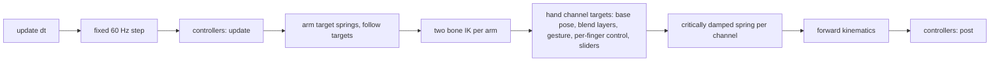

# hands: module internals

The procedural hand and arm library that lives in `hands/src`. It imports nothing but `three` (only `three-view.js` does, for rendering) and never touches the DOM, so every line runs under `node --test`. The repository README covers what the library is for and how to run the sandbox; this file covers how it works inside and how to extend it.

Units are metres, kilograms and seconds. Angles are radians in code and degrees in data tables.

## Files

| File | What it owns |
| --- | --- |
| `index.js` | The public API: `create()` returns a `Hands` instance; re-exports the building blocks |
| `rig.js` | `Rig`: skeleton plus solvers, pose layers, per-finger control, springs, IK per step, controllers |
| `skeleton.js` | 30 joints per side: shoulder, upper arm, forearm, two twist bones, the 25 WebXR hand joints |
| `anatomy.js` | Every length, limit and coupling ratio, each with its source |
| `fingers.js` | Pose to channel resolution, natural coupling, per-finger curl and spread mapping |
| `poses.js` | Named hand poses as per joint data in degrees |
| `grasp.js` | Grip taxonomy, pre-shape, closure to contact, object placement and attachment |
| `ik.js` | Two bone arm IK with a pole, reach clamping, pronation shared in thirds |
| `springs.js` | Critically damped springs and the under damped oscillator |
| `mesh.js` | Lofted skinned arm and hand mesh, skin weights, vertex colour |
| `three-view.js` | `createThreeView`: one `SkinnedMesh` per arm for a three.js scene |
| `stones.js` | Procedural pebbles, rocks and the sachet |
| `clock.js`, `rng.js`, `math.js` | Fixed step clock, seeded generator, dependency free vector and quaternion math |
| `defaults.js` | Skin tones, sleeve colours and object presets, all overridable |

## One step

Every animated channel goes through a critically damped spring, stepped with its exact closed form so the result is repeatable bit for bit:

$$\ddot x = -\omega^2 (x - x_t) - 2\omega\,\dot x$$

## Per-finger control

`setFinger(hand, finger, curl, spread)` and `setFingerJoint(hand, finger, joint, curl)` put a digit under direct control. Curl 0 to 1 maps onto each joint's flexion range from `anatomy.js`, spread -1 to 1 onto MCP abduction. The control blends in over whatever pose is active through its own spring weight, so a finger can be driven while a gesture plays on the rest of the hand. Fingers that are not under control follow a controlled neighbour by the enslaving fractions in `COUPLING.enslave`, which is what keeps a curled ring finger from leaving the little finger perfectly straight. `releaseFingers` hands the digit back to the pose.

Joint mapping

| Digit | Joint | curl 0 | curl 1 |
| --- | --- | --- | --- |
| index to little | MCP | 0 deg | 90 deg |
| index to little | PIP | 0 deg | 100 deg |
| index to little | DIP | follows PIP at 2/3, or 0 to 90 deg when set | |
| thumb | CMC | sweep -12 deg, palmar abduction -12 deg | sweep 48 deg, palmar abduction 10 deg |
| thumb | MCP | 0 deg | 60 deg |
| thumb | IP | 0 deg | 88 deg |

## Isolation

`test/isolation.test.js` (run by `npm test` in the gate) and the `isolation:` row of `npm run hands:check` lex every file under `hands/src`, strip comments and string bodies, and fail if an import resolves outside `hands/`, names any package but `three`, is a computed dynamic import, or if `window` or `document` appears in code.
